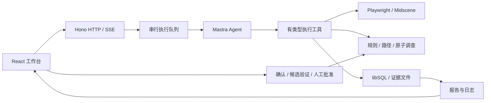

# 当前架构与 Agent 职责

状态：采用现有技术栈，停止框架和模型优化矩阵。本文描述当前实现；明确标注的后续能力不属于已交付功能。

UI Sentinel 是由 Agent 主导的 Web 质量检查服务。Agent 根据任务探索页面、提出并验证问题；规则与执行工具负责复用已知检查、控制副作用、测量和保存证据。规则未命中不代表页面合格，业务完成也不代表质量检查完成。

## 模块与数据流

| 模块 | 当前责任 |
| --- | --- |
| src/agent | 探索政策、有限上下文、模型请求与计时、结束判断、规则候选生成 |
| src/execution | 队列与取消、页面控制、工具验证、预算、事实与证据、可靠终结 |
| src/rules | 规则目录、按事实路由、共享检查、声明式时序规则 |
| src/server | HTTP/SSE、控制接口、持久报告组装 |
| src/storage | 数据表与事务；模型 SDK 不拥有运行状态 |
| src/web | 本地任务创建、报告、日志、证据及反馈操作 |
| arena / evaluation | 可重复业务靶场、私有真值、评分与验收支撑 |

Mastra Core 提供 Agent/Tools；Playwright 提供浏览器状态、动作和证据；Midscene/Qwen 提供必要的视觉定位。Hono、libSQL、React 分别负责服务、持久化、工作台。没有 Effect 依赖，也没有保留第二套 Stagehand/Browser Use 运行循环。

## Agent 的职责

1. 理解任务、产品约束与允许操作，选择探索范围和下一步。
2. 使用当前页面事实与语义定位目标；名称、位置变化时重新判断，不依赖固定业务元素 ID。
3. 查询相关规则，绑定当前触发事件和目标，复用已验证路径与调查。
4. 在没有规则时提出假设，采集能够支持或反驳假设的证据，说明未知和未覆盖范围。
5. 按证据主动结束；明确业务结果、检查完成度和阻断，不能用自然语言自称完成。
6. 将人工确认的发现转为规则候选；验证正例、反例和 unknown，由人批准发布。

Agent 不拥有无限执行权限：动作预算、导航边界、重复写入保护、证据有效性和最终提交由执行层执行。模型建议与实际执行日志分别记录，不存储或要求模型私有思维链。

## 端到端流程

创建任务后，服务将其排队并持久化。执行器打开页面，提供 a11y、文本、元素引用和近期关键事实。Agent 探索并调用工具；每个动作返回结果和必要的后置观察。规则按事实和触发条件选择，语义规则由 Agent 绑定后执行。

时序问题可调用一次有类型原子调查，由执行层完成整个采样窗口，减少模型逐次等待。最终 run_finish 由执行器核对未决假设、测量、业务状态和证据。报告从持久记录生成；完成提交还由新连接核验，不一致时隔离并等待核对。

有限 Jev 阻断审查是可选能力，默认关闭。它只处理已有充分证据的阻断收尾建议，不能替代开放探索；所有建议仍需执行器复核。[执行契约](execution-engine.md)包含具体边界。

## 当前部署与并发边界

当前为受信单机、loopback 服务；Web 是同端口工作台。任务串行，页面只有一个写入者。尚未实现多用户认证、远程 Worker 或分布式调度。当前业务适配仍偏向购物，第二个完整业务是[下一步计划](../plans/next-development-plan.md)。

未来多机部署可由唯一控制服务暴露 Web/API，Worker 主动连接控制服务，不要求每个 Worker 暴露公网端口。共享账号的服务端状态不能通过复制浏览器 storageState 隔离；只有确认资源独立的任务才能并行，登录快照不是数据库事务分叉。该设计暂不实施。

## 证据与演进边界

发现关联截图、动作、规则版本、实际测量和来源；红框是证据副本，不覆盖原图。DOM 命中拦截不自动证明视觉遮挡，执行器拦截造成的现象不能归因于被测产品。

已完成的最小验证与已知限制统一见[验收基线](validation-baseline.md)。PRD/Figma 导入、完整知识检索、主动视觉体验发现仍是后续方向，不因本文列出其职责就视为实现。
