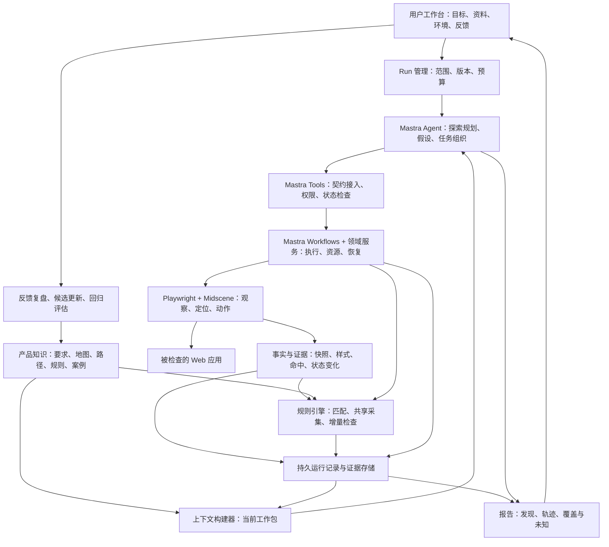

# 应用总体架构

日期：2026-09-20  
状态：目标设计，包含已实现部分与后续规划；当前实现及冻结验收以[进度记录](../plans/minimum-validation-progress.md)为准

范围：产品定位、系统模块、Agent 控制循环、执行与数据流、并发隔离、知识演进和部署边界。

## 1. 产品定位

本应用是面向 Web 应用质量的 Agent 系统。用户提供检查目标、应用入口、测试环境和可选的 PRD / Figma，Agent 自主理解页面、探索状态与路径、提出问题假设、操作验证并提交证据。

系统关注视觉一致性、布局、交互反馈、关键路径正确性、流畅度和响应时间。已有规则用于提速、保证一致性和节约 token；没有对应规则时，Agent 仍可发现新问题。

Agent 决定探索与验证方向；执行层负责可靠操作与取证；知识库提供产品要求和历史经验；人工反馈帮助系统更新判断依据。

不要求人工预先穷举全部页面、场景和规则，也不承诺 Agent 穷举所有状态。运行报告明确已探索范围、未完成检查和停止原因。

## 2. 总体架构图



图中模块是目标逻辑边界，不表示每个模块都已实现或需要独立服务。当前使用 Mastra Agent/Tools、自有串行执行器、Hono HTTP/SSE、libSQL 和 React 工作台；通用 Workflows、知识检索和分布式任务图尚未按图实现。浏览器动作必须经过工具和执行层；报告事实关联持久证据。

## 3. 核心模块与责任

| 模块 | 职责 | 不负责 |
| --- | --- | --- |
| 用户工作台 | 项目和环境配置、启动检查、查看报告和提交反馈 | 手动编排每一次浏览器操作 |
| Run 管理 | 固定目标、范围、版本、预算和生命周期 | 用模型一句话替代实际执行状态 |
| Mastra Agent 与项目探索逻辑 | 理解产品与页面、动态探索、提出假设、组织任务、解释结果 | 绕过工具直接改变资源或规范 |
| 上下文构建器 | 按当前任务加载必要知识和证据，维护工作包 | 全量加载知识库或丢弃关键约束 |
| 工具服务 | 类型化工具契约、权限、请求去重、合法反馈 | 将任意模型参数视为已授权事实 |
| 执行与资源调度 | 任务图、账号分配、检查点、动作、等待、清理 | 自动复制服务端数据或撤销已发出的请求 |
| 事实与证据层 | 标准化观察、来源、时间、截图和测量 | 将几何重叠直接等同于业务违规 |
| 规则引擎 | 已知规则的路由、检查和结构化结果 | 限制 Agent 只能发现已有规则定义的问题 |
| 知识服务 | 来源、范围、修订、关系、检索和例外 | 将当前实现自动作为正确要求 |
| 报告与反馈 | 聚合发现、执行轨迹、覆盖边界和反馈 | 因最终任务成功删除原始问题 |

### 3.1 已确定的技术职责

| 技术 | 使用位置 |
| --- | --- |
| TypeScript | 应用执行与规则接口的主要语言 |
| Mastra | Agent、工具、工作流、Server、存储接入、追踪和开发调试底座 |
| Playwright | 浏览器操作、DOM/CSS、命中验证、状态观察与取证 |
| Midscene.js | 动态视觉定位和语义、视觉判断补充 |
| 自有规则引擎 | 声明式规则、访问器、生命周期 Hook 和覆盖记录 |

当前依赖版本由 package.json / pnpm-lock.yaml 锁定，数据库使用本地 libSQL，模型从配置接入；DeepSeek/Qwen 已有冻结验收记录。上表描述技术职责范围，不能据此认为 Mastra Workflows、Server 或通用知识存储已接入，具体运行约束见 README。

### 3.2 框架复用与领域自研边界

Mastra 是唯一的 Agent 应用编排底座，优先复用其模型调用、Tools、Workflows、Server、存储接口和开发追踪。不另外建设平行的 AI SDK Agent 循环，也不再依赖通用函数式执行框架。

自研内容集中在探索状态图、假设验证、UI 事实模型、规则引擎、账号与业务资源隔离、浏览器恢复、证据报告及版本化产品知识。框架 Agent 负责自主探索，Workflows 负责明确且可复用的步骤，不将未知探索全部编写为固定工作流。

框架运行状态和项目领域状态通过 ID 关联：工作流当前位置由框架维护，项目记录资源、快照、发现和业务副作用。框架快照不包含可复活的浏览器内存；框架 Memory 不替代规范知识；Studio 是开发工具，不是客户工作台。


## 4. Agent 的双循环

### 4.1 自主探索循环

```text
理解目标和相关知识
  → 观察当前页面
  → 更新状态图与待探索分支
  → 选择高价值状态或问题假设
  → 制定并执行验证
  → 保存支持、反驳或未知证据
  → 更新计划，继续或记录停止原因
```

状态图逐步构建。相同 URL 下的弹窗、权限、加载、错误与成功状态可能需要分别记录。访问过不表示全部检查完成。

Agent 根据业务重要性、近期变化、未知程度和预算调整优先级。发现活动浮层时可以动态增加关闭、遮挡和重复出现等验证，无需预先存在完整 Journey。

探索策略是知识库中可检索、可版本化的探索经验，为 Agent 提供线索生成与采样方法。任务完成不代表体验检查完成；策略按状态和风险选择，在预算内探测替代操作，再由规则或工具验证。能验证指定问题与能自主发现问题必须分别评估，具体见[探索策略与未知问题发现](./exploration-strategies.md)。

### 4.2 已知能力复用循环

```text
到达已知状态或事件
  → 按事实与配置匹配已有规则
  → 共享采集，运行确定性检查
  → 返回结果、缺失事实和证据
  → Agent 对异常或新情况展开调查
```

基础规则由引擎保证执行，Agent 通过检索补充选择。规则源码留在执行层，模型通常只读取清单和结果。

没有规则时，可以通过受控观察和动作 API 验证假设；不能因此绕过权限或任意运行新代码。缺少检测能力时提出扩展需求并标明未验证范围。

## 5. 一次检查的端到端流程

1. 用户提交目标、入口、环境和可选资料；系统创建 Run，固定配置与知识修订。
2. 上下文构建器加载相关要求、已有路径、规则清单和案例，形成当前工作包。
3. Agent 观察入口，识别用途和状态，建立或更新探索图。
4. Agent 创建有边界的任务；调度器分配账号、业务资源和执行预算。
5. Worker 创建独立浏览器上下文，恢复检查点并验证前置条件。
6. 对每次动作，先确定目标、保存原始现场、运行前置规则，再操作并等待结果。
7. 规则引擎检查已知约束；Agent 组合工具验证新假设。
8. 事件、快照、发现和任务结果持久保存；工作包随重要状态变化更新。
9. Agent 根据新增信息继续、分叉、等待或结束，输出证据与覆盖边界。
10. 人工反馈进入复盘，生成规则、路径或其他知识候选，经验证后发布修订。

### 5.1 示例：活动 banner 阻挡下单

```text
目标：检查活动期间购买流程
  → 登录并保存检查点
  → 进入订单页，记录活动浮层
  → 定位提交操作，动作前发现阻挡
  → 保存原始视口、命中结果和问题记录
  → 按允许策略检查并关闭浮层
  → 再次验证提交操作，继续测试支付
  → 报告：订单结果符合预期，但存在阻挡及额外关闭操作
```

如果没有适用遮挡规则，Agent 可以先登记假设，再调用布局、命中和动作验证能力。可靠发现不要求先生成规则。无法关闭则报告阻断；不使用删除 DOM 或强制点击消除被检查问题。

## 6. Agent 接入与执行协议

Agent 使用表达工作目标的工具：知识检索、观察、动作、检查、检查点、任务分叉与等待、探索图更新、假设登记、发现提交和知识提议。

```text
结构化请求
  → schema / 权限 / 状态版本校验
  → Mastra 工具 / 工作流与领域执行服务
  → 资源准入、浏览器操作、检查、持久化
  → 结构化摘要、证据引用及合法下一步建议
```

模型不直接管理锁、浏览器句柄或数据库连接。正常动作自动执行基础检查和取证，不依赖 Agent 主动调用每个辅助 API。

主 Agent 负责整体计划和汇总；任务 Agent 负责局部理解与验证。确定性任务不需要模型会话。这是职责划分，不要求每项职责对应独立 Agent 或不同模型。

工具失败返回可处理的状态，例如 queued、stale-state、ambiguous、outcome-unknown。下一步建议不是穷举清单，但新请求同样受准入约束。工具状态、业务结果和规则结果分别记录。

## 7. 任务图、账号与资源隔离

任务分叉只表示创建工作，不保证立即并行：

- 多条只读规则共享不可变快照。
- 独立页面交互使用独立浏览器上下文。
- 同一账号购物车写入互斥，相关读任务不能与写入冲突。
- 不同账号仍可能操作同一库存、订单或组织配置，需要业务资源隔离。
- 退出登录等会话失效操作排他执行。
- 未明确副作用的任务采用保守隔离策略。

登录检查点复用可恢复会话与进入状态的方法，不复制浏览器内存或服务端数据。每个分支恢复后重新核对权限和数据条件。

Mastra 承载 Agent 和工作流执行，领域调度器控制账号资源与并发预算。工作流分支不等于独立进程，也不自动分配浏览器上下文。持久恢复需配置并验证存储和 runner；跨 worker 资源协调必须采用共享机制。

取消不等于回滚。写操作结果未知时先核对，不能立即释放为干净资源并重试。具体锁和恢复策略见执行层文档。

## 8. 核心数据对象与关系

| 对象 | 作用 | 关键关联 |
| --- | --- | --- |
| Project / Environment | 检查范围和测试环境 | 资料、账号要求、项目策略 |
| Run | 一次检查的生命周期与版本配置 | 任务图、预算、覆盖、终态 |
| Task / Action | 原子工作和实际操作 | 父子任务、资源、检查点、请求 ID |
| Exploration graph | 已发现状态、动作边和未探索分支 | 快照、任务、停止原因 |
| Hypothesis | 可验证假设及计划 | 依据、验证动作、支持或反驳证据 |
| Checkpoint | 恢复会话与验证前置状态 | 账号、会话安全引用、fixture |
| Snapshot / Fact | 特定时间和条件下的观察 | DOM、样式、截图、测量来源 |
| Rule evaluation | 已有规则的具体执行结果 | 规则修订、配置、对象、事实版本 |
| Finding | 有来源和证据的问题或建议 | 规则或假设、现场、影响、反馈 |
| Event | 可追踪的执行事实 | run/task/step/action、时间和因果引用 |
| Knowledge revision | 长期知识的不可变修订 | 来源、范围、确认状态和替代关系 |
| Work packet | 当前模型任务的工作记忆 | 未决状态、知识修订、证据和预算 |

Rule evaluation 可以通过或未知，不必产生 Finding。Finding 可以来自规则，也可以来自 Agent 假设验证；后者不强制存在 ruleId。

规则失效与模型会话结束不应导致原始证据丢失。定位缓存属于可重建加速数据，不是规范或唯一运行状态。

## 9. 存储、检索与上下文

逻辑存储分为：

- 关系数据：运行、任务、资源、知识修订、路径、规则和关系。
- 原始资料与证据：文档、设计快照、截图、DOM 和执行文件。
- 检索索引：全文检索和按需增加的语义索引。
- 缓存：定位、解析与重复检索加速。

长期知识、运行工作状态、原始证据和缓存分开治理。产品要求、观察事实和模型推断不能混合成一种无来源文本。

上下文构建器按项目、范围、角色和版本过滤知识，再按需读取相关条目。固定约束和必要预期通过结构化依赖加入，不依赖语义检索碰巧命中。

模型上下文包含短协议、当前工作包、相关知识和按需展开的证据，不包含全库。长任务通过持久状态构建新会话，必须保留权限、未决写操作、未知项与停止条件。父任务读取子任务摘要和证据引用，不接收所有原始对话。

## 10. 结果、可观测性与反馈闭环

### 10.1 结果分层

- 业务结果：success、rejected 或尚未取得结果。
- 执行状态：completed、blocked、timed-out、cancelled 或 execution-error。
- 规则结果：pass、fail、skip、unknown 或 error。
- 探索发现：candidate、supported、refuted 或 inconclusive；主观 suggestion 单独标记。

这些维度不能合并成一个“成功/失败”。支付按预期被拒绝可以通过；最终购买成功仍可能包含体验违规。

### 10.2 证据与复盘

问题报告包含预期依据、实际结果、步骤、条件、原始截图、测量和恢复记录。标注图由可信坐标生成并保留原图，视觉估计明确标识。

执行事件和知识检索记录是复盘基础；Mastra tracing 用于关联模型、工具和工作流的耗时与执行结构，不替代持久业务记录。记录可验证观察、模型输入输出和简短决策依据，不要求模型内部思维链。

### 10.3 持续改进

```text
人工反馈或已知案例评估
  → 定位探索、采集、检索、判定、恢复或报告的问题
  → 提议修改
  → 形成正反案例与回归检查
  → 验证影响和误报
  → 发布规则 / 路径 / 映射 / 探索策略修订
```

知识候选不自动变为有效规范。更新有来源、范围、版本和既定审阅策略，可追溯和撤销。历史快照不足以验证交互时，重新准备场景复现。

## 11. 运行与部署边界

产品是长期运行的 Server 应用，Web 工作台是它提供的客户端。Mastra Server 提供 Agent、工作流与自定义业务 API；产品前端构建产物通过同一入口提供，必要时使用 Server Adapter 或反向代理集成。具体前端框架不在此次底座调整中锁定。

```text
统一端口 / 域名
  ├─ /             产品 Web 工作台
  ├─ /api/...      项目、Run、反馈和知识接口
  └─ /events/...   可重连的进度订阅
          ↓
Mastra Agent / Workflows + 领域调度
          ↓
本机或多机器浏览器 Worker
          ↓
共享持久状态与证据存储
```

创建检查异步返回 runId，任务生命周期不绑定 HTTP 请求或 Web 订阅。关闭页面不会停止检查；重新连接后按游标获取持久事件。模型输出流是交互通道，不代替任务状态和事件记录。

单机可由一个启动入口启动 Server 与本机 Worker；多机只对用户提供统一 Web/API 入口。Worker 接收任务并上传状态和证据，不分别提供产品网站。内网 Worker 可主动连接 Server，具体传输和任务投递由选定 runner / 适配层实现。

历史截图从证据存储读取；如需远程浏览器实时画面，通过授权的 Server 路由或连接代理呈现，不直接暴露调试端口。多机通信、认证和实时画面传输尚需实现验证。

模块可以部署为模块化应用与后台 Worker，不强制微服务。优先使用 Mastra 支持的存储和 runner 接口承接通用执行，保留项目特有的资源准入策略。多机 runner 的选型尚未完成，不能把框架并行步骤当作已实现的分布式队列。

多 worker 部署时：

- 任务状态、检查点和重要事件共享持久化。
- 请求 ID 去重不等于外部业务 exactly-once，恢复时仍要核对实际结果。
- 资源锁需要协调所有 worker，并处理租约失效后旧 worker 仍操作的风险。
- 崩溃不能依赖 finally 清理一定运行，需外部清理和副作用核对。
- 模型、浏览器、账号和业务资源分别限制并发与预算。

被检查环境、测试账号和写操作范围由项目明确配置。会话秘密不进入模型和普通日志；页面内容属于不可信输入，不能改变系统权限。截图与资料按访问范围、脱敏和保留策略管理。

## 12. 关键架构约束

1. Agent 是探索主体，规则和预设路径不是启动检查的必要条件。
2. 已知规则自动覆盖与 Agent 主动探索同时存在。
3. 所有改变页面或业务状态的动作经过受控执行入口。
4. 动作和恢复前先保留现场，恢复成功不删除原始问题。
5. 假设不等于发现，实际行为不等于正确规范。
6. 业务 rejected、规则 fail 和执行错误分开处理。
7. 任务可以随时分叉，是否并行由实际资源冲突决定。
8. 登录复用不等于服务端数据或运行内存复制。
9. 未知与未覆盖必须可见，不承诺穷举整个应用。
10. 必要依据和未决副作用不能因上下文裁剪而丢失。

## 13. 验证目标与尚未完成的选择

验收应覆盖没有现成规则时的新问题发现、按钮改名/移位/无属性、活动浮层遮挡、关键路径预期拒绝、少量账号并发、未知写操作恢复、知识版本冲突和长任务上下文恢复。

评估同时考虑发现质量、证据完整性、已知范围覆盖、执行可靠性、检索有效性与模型/浏览器成本，不能单独以任务完成率或 token 消耗作结论。

建立可运行、可重置、有独立答案的靶场库，覆盖已知规则、合理例外、无规则探索和故障恢复。开发团队维护框架与可信评估，应用 Agent 提出并构建候选案例，独立评审流程负责预期核验和正式入库。被测 Agent 不可读取或修改私有答案、评分器和发布门槛。

靶场在成熟阶段继续承担发布回归、模型成本比较和真实漏报复盘。区分开发、回归与保留评估集，不将已参与调优的案例当作新问题泛化证据。详细设计见[验证靶场库与持续评估](./arena-and-evaluation.md)。

已确定的是架构职责和 TypeScript / Mastra / Playwright / Midscene 技术分工。当前已确定运行依赖、模型接入和本地存储，并有受控靶场验证。尚需独立实现或扩大验证的事项包括跨 worker 协调、跨业务定位与事实适配、主动视觉发现、规则路由及不同规模下的上下文预算。

这些事项不得在报告中描述为已实测能力，也不能以未决定具体产品为由省略持久化、隔离和证据等架构要求。

## 14. 文档导航

| 文档 | 详细内容 |
| --- | --- |
| [当前实现与进度](../plans/minimum-validation-progress.md) | 冻结验收、已实现范围和未完成项 |
| [下一轮执行效率计划](../plans/execution-efficiency-plan.md) | 测量、观察优化、规则路由、路径复用与受控对照 |
| [最小可验证路径开发计划](../plans/minimum-validation-plan.md) | 原始范围、靶场矩阵和放行门槛 |
| [Agent 职责与整体工作模式](./agent-responsibilities.md) | 八项职责、角色边界、探索循环和评价目标 |
| [探索策略与未知问题发现](./exploration-strategies.md) | 线索生成、策略契约、交互采样、漏报复盘与独立评估 |
| [规则与规则库技术设计](./rules-and-rule-library.md) | 规则定义、访问器、Hook、关键路径和规则路由 |
| [执行层技术设计](./execution-engine.md) | 原子任务、工具契约、Mastra、资源、证据与日志 |
| [知识库与上下文技术设计](./knowledge-and-context.md) | 知识分类、版本、检索、工作包和长任务恢复 |
| [验证靶场库与持续评估设计](./arena-and-evaluation.md) | 案例与变体、独立评分、维护分工和发布回归 |

总体文档负责跨模块关系，专题文档负责接口细节。后续修改影响层间契约时同步更新相关文档，不维护相互矛盾的重复定义。
