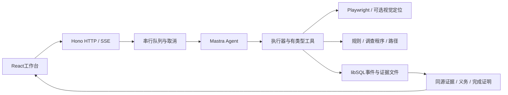

# 当前架构与职责

2026-10-09。R0阶段交付完成，可支持R1离线工作；真实模型稳定性与正式验收待完成。实现范围见 [R0最终交付](r0-delivery.md)，演进方向见 [Roadmap](product-roadmap.md)。

UI Sentinel 是绑定loopback的受信单机服务，采用TypeScript、Mastra Core、Playwright、Midscene/Qwen、Hono、libSQL和React。工作台与API同端口；队列串行，关闭工作台不取消任务。没有多用户认证、远程Worker、分布式调度或第二套浏览器Agent循环。

```mermaid
flowchart LR
  UI[React工作台] --> API[Hono HTTP / SSE]
  API --> Queue[串行队列与取消]
  Queue --> Agent[Mastra Agent]
  Agent --> Tools[执行器与有类型工具]
  Tools --> Browser[Playwright / 可选视觉定位]
  Tools --> Rules[规则 / 调查程序 / 路径]
  Tools --> Store[libSQL事件与证据文件]
  Store --> Report[同源证据 / 义务 / 完成证明]
  Report --> UI
```

## 模块边界

| 模块 | 责任 |
| --- | --- |
| `src/business` | 注册业务契约、配置冻结、公开协议适配及统一业务事实 |
| `src/inspection` | UI契约、来源及两维义务、目标/导航边界、scope投影、完成与历史证明 |
| `src/agent` | 提议调查和动作、有限上下文及模型交互；不能自授权限或写通过状态 |
| `src/execution` | 串行工具派发、预算/取消/副作用、网络边界、采样/测量和证据持久关联 |
| `src/rules` | 规范化事实驱动规则、适用性与批准的声明式规则 |
| `src/storage` / `src/server` | 持久层与HTTP/SSE/报告；模型SDK不拥有run状态 |
| `src/web` | 创建、取消、报告、历史、证据与反馈 |
| `evaluation` / `arena` | 场景和独立评分；私有真值不进入生产提示或判断 |

## 一个执行器，两类任务契约

`RunSpec.kind`区分business与ui-scan。业务模式保留购物checkout@1和导出export@1的注册要求、环境、副作用预算与业务事实；无kind的历史按原语义解释。UI模式不装配空业务profile、不使用业务结果作为通过依据，businessResult固定not-applicable。共用的是生命周期、工具、浏览器、证据和规则机制。

UI先冻结入口、来源、scope/access和预算并计算hash，再安装网络会话，最后导航。网络边界逐跳检查导航、资源和GET数据权限；匿名有界模式不支持登录、业务写入、POST查询、上传下载、新窗口、WebSocket等。不能按按钮名称推定安全，不能以资源许可授予API许可。

## R0 v2 同item两维检查

原itemId与选样义务保持稳定，追加scope事件而非另一套任务账本：

- sourceReview登记有界公开来源；未完成、歧义、冲突、超限或晚到均保留缺口。
- generic关联一次原动作、操作前观察、动作后立即及约1000ms反馈采样、规则结算和可读回执；反馈变化本身不是功能正确证据。
- effects保存独立要求及冻结谓词、来源/结果/原action关联和测量状态。generic不能抵消必需效果；真实failed与未测unverified不同。

新版本为url-scan-default-4 / bounded-ui-sampling-2 / default-check-contract-2 / public-effect-sources-1，工具29，item-checks-2，inspection-proof-4，ui-check-report-2。历史revision/hash与旧证明按原分支解释，新旧评分分开。详细合同、限制与证据见[阶段交接](../plans/r0-default-check-v2-handoff.md)。

## 执行与结束

Agent只能选择已登记事项并提出调查，执行器掌握权限、目标绑定、预算、动作和完成判定。只读恢复使用原checkRef及requirementId，两个purpose共享次数上限，不自动重放原点击。fill局部值成立不证明应用业务效果。规则unknown、不适用和未采样分别记录，不当作通过。

covered需要全部必需义务有据结算，允许含已证缺陷；未完成效果、来源或generic保留partial。取消、执行故障、干预和证据失配优先否决完整完成。未知写入不自动重放；重启未完成任务中断并保留隔离。历史持久异常尚未定位，不能把这些机制描述成已证明无故障的可靠性保证，见[已知问题](known-issues.md)。

## R1接入与未来边界

本次main只交付[固定六状态公开包](../plans/r0-r1-dependency-v2/README.md)和只读提取工具；R1消费代码仍在独立分支。候选、选中身份、两维待办、公开DOM/规则及原check/action回执可支持离线调查排序；实时权限/节点/费用unknown不自动阻断建议，但禁止直接派发声明。程序和未来Jev必须读同一完整事实及候选，历史选择/评价另存。

当前没有自主通用状态遍历、任意资料自动理解或R1默认执行接线。详细实现分别见[执行层](execution-engine.md)、[可组合调查](composable-investigations.md)、[规则](rules-and-rule-library.md)和[评估](arena-and-evaluation.md)。
