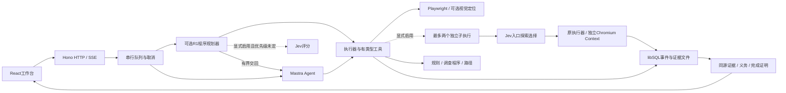

# 当前架构与职责

2026-10-10。R0阶段交付完成；R1本期程序优先探索已通过28项真实验收并合入main。实现范围见 [R0阶段交付](r0-delivery.md)和[R1最终交付](r1-delivery.md)，演进方向见 [Roadmap](product-roadmap.md)。R0历史正式验收缺口继续保留。

UI Sentinel 是绑定loopback的受信单机服务，采用TypeScript、Mastra Core、Playwright、Midscene/Qwen、Hono、libSQL和React。工作台与API同端口；顶层队列串行，显式开启时单个UI扫描内可委派最多两个隔离子执行，关闭工作台不取消任务。没有多用户认证、远程Worker、分布式调度或第二套浏览器Agent循环。

```mermaid
flowchart LR
  UI[React工作台] --> API[Hono HTTP / SSE]
  API --> Queue[串行队列与取消]
  Queue --> Planner[可选R1程序规划器]
  Planner --> Tools
  Planner -->|有界交回| Agent[Mastra Agent]
  Queue --> Agent
  Planner -. 显式启用且优先级未定 .-> Jev[Jev评分]
  Agent --> Tools[执行器与有类型工具]
  Tools --> Browser[Playwright / 可选视觉定位]
  Tools -. 显式启用 .-> Children[最多两个独立子执行]
  Children --> PopupJev[Jev入口探索选择]
  PopupJev --> ChildBrowser[原执行器 / 独立Chromium Context]
  ChildBrowser --> Store
  Tools --> Rules[规则 / 调查程序 / 路径]
  Tools --> Store[libSQL事件与证据文件]
  Store --> Report[同源证据 / 义务 / 完成证明]
  Report --> UI
```

## 模块边界

| 模块 | 责任 |
| --- | --- |
| `src/business` | 注册业务契约、配置冻结、公开协议适配及统一业务事实 |
| `src/inspection` | UI契约、来源及两维义务、目标/导航边界、scope投影、完成与历史证明 |
| `src/agent` | 提议调查和动作、有限上下文及模型交互；不能自授权限或写通过状态 |
| `src/execution` | 串行工具派发、预算/取消/副作用、网络边界、采样/测量和证据持久关联 |
| `src/rules` | 规范化事实驱动规则、适用性与批准的声明式规则 |
| `src/storage` / `src/server` | 持久层与HTTP/SSE/报告；模型SDK不拥有run状态 |
| `src/web` | 创建、取消、报告、历史、证据与反馈 |
| `evaluation` / `arena` | 场景和独立评分；私有真值不进入生产提示或判断 |

## 一个执行器，两类任务契约

`RunSpec.kind`区分business与ui-scan。业务模式保留购物checkout@1和导出export@1的注册要求、环境、副作用预算与业务事实；无kind的历史按原语义解释。UI模式不装配空业务profile、不使用业务结果作为通过依据，businessResult固定not-applicable。共用的是生命周期、工具、浏览器、证据和规则机制。

UI先冻结入口、来源、scope/access和预算并计算hash，再安装网络会话，最后导航。网络边界逐跳检查导航、资源和GET数据权限；匿名有界模式不支持登录、业务写入、POST查询、上传下载、新窗口、WebSocket等。不能按按钮名称推定安全，不能以资源许可授予API许可。

## R0 v2 同item两维检查

原itemId与选样义务保持稳定，追加scope事件而非另一套任务账本：

- sourceReview登记有界公开来源；未完成、歧义、冲突、超限或晚到均保留缺口。
- generic关联一次原动作、操作前观察、动作后立即及约1000ms反馈采样、规则结算和可读回执；反馈变化本身不是功能正确证据。
- effects保存独立要求及冻结谓词、来源/结果/原action关联和测量状态。generic不能抵消必需效果；真实failed与未测unverified不同。

新版本为url-scan-default-4 / bounded-ui-sampling-2 / default-check-contract-2 / public-effect-sources-1，工具29，item-checks-2，inspection-proof-4，ui-check-report-2。历史revision/hash与旧证明按原分支解释，新旧评分分开。详细合同、限制与证据见[阶段交接](https://github.com/FailLone/ui-sentinel/blob/25409ce/plans/r0-default-check-v2-handoff.md)。

## 执行与结束

Agent只能选择已登记事项并提出调查，执行器掌握权限、目标绑定、预算、动作和完成判定。只读恢复使用原checkRef及requirementId，两个purpose共享次数上限，不自动重放原点击。fill局部值成立不证明应用业务效果。规则unknown、不适用和未采样分别记录，不当作通过。

covered需要全部必需义务有据结算，允许含已证缺陷；未完成效果、来源或generic保留partial。取消、执行故障、干预和证据失配优先否决完整完成。未知写入不自动重放；重启未完成任务中断并保留隔离。历史持久异常尚未定位，不能把这些机制描述成已证明无故障的可靠性保证，见[已知问题](known-issues.md)。

## R1程序优先探索

普通工作台的“R1有界探索”及API `exploration: { mode: "program", jev: false }` 显式启用运行级冻结策略；省略时保持原扫描路径。`src/agent/exploration` 管理公开状态、候选前沿、路径、去重、公平性及策略；`integration/product-host.ts` 提议原工具调用，执行器继续掌握实际权限、动作预算、测量、取消与完成门，没有第二套通过账本。

每页最多3项本地控件或相关状态、24个程序步骤、2次返回/刷新额度。支持有限原生文本输入的公开maxlength边界；返回/刷新限明确公开目标与已观察同源URL，不等于恢复登录会话或浏览器历史栈。状态更新创建新义务并保留原测量；恢复不能重放副作用。公开目标/结果歧义交回后仅允许只读调查与partial收尾，唯一CSS定位不代表语义消歧。

报告把规划路径连接到原action、item及可读证据，分别展示已访问、已测量、遗漏和交回原因，历史报告使用同一持久投影。主模型单请求默认60秒，仍取实际剩余运行期限；验收不再单独使用15秒期限。

Jev默认关闭，需请求和服务端共同显式启用、已有批准费用账户及实时权限复查。只在有限多候选优先级尚未确定时参与评分，不覆盖执行器准入、公平性与安全限制。当前28项验收使用program且Jev为0，证明本期产品行为，不证明Jev收益；后续收益研究独立开展。固定六状态包和旧离线研究仍保留，不能以离线建议替代实时执行证据。

目前仍不提供任意网站全状态遍历、任意资料自动理解或任意业务副作用操作。详细实现见[执行层](execution-engine.md)、[可组合调查](composable-investigations.md)、[规则](rules-and-rule-library.md)、[评估](arena-and-evaluation.md)及[R1交付](r1-delivery.md)。

## 普通网址扫描的规则与 DNS 接线

规则分支已通过 `5e3255b` 合入 main。执行器的 `createUiRuleObservation` 复用同次页面观察和截图，在网址检查中自动评价 D005 原生控件文字消失，并持久化 R005 缺图审查材料；报告与历史恢复共用保存的证据。R005 不产生缺陷或健康 pass，D005 仅在限定绘制条件下判定；未知与省略单列。D004 图片比例仍需明确保形依据，默认关闭。普通业务任务不自动启用上述补充检查，全局 `EXECUTION_URL_SCAN` 默认值不变。

部署可显式配置有界 DoH；默认仍走 system DNS。DoH 只允许配置的精确域名，连接前复查全部地址并固定地址连接，保留 Host/SNI/TLS 和私网拒绝；不提供任意代理或 fake-IP 绕过。支持范围及已知性能/证据局限见[规则整合交接](rule-library/rules-main-integration-handoff.md)和[DNS 说明](network-dns-compat.md)。

D001/D002后续通过 `3350042` 合入main，沿同一适配器自动测量原生单行文字的有限垂直裁切/兄弟控件遮盖。几何只筛候选，同次截图与隔离参考字形对照才支持像素结论；参考图不冒充目标页面截图。正常滚动、省略、弹层或未确认的脚本/交互恢复路径不会仅凭越界判缺陷。历史报告新增可选layout字段并校验布局证据摘要，旧记录兼容。详见[范围、验证与合并](rule-library/rules-clipping-overlap-delivery.md)。

## 目标驱动弹窗与并行子执行

初版经 `038a157` 合入；`878edc0` 进一步合入候选 `373abc8`，包括官方协议修复、嵌套入口探索和可观察浮窗契约。`EXECUTION_POPUP_JEV=1` 和请求 `popupCheck: { mode: "popup-viewport" }` 开启弹窗路径；追加 `EXECUTION_PARALLEL_CHECK_TASKS=1` 后，父Mastra Agent通过 `check_task_submit/status/wait/cancel` 委派。新请求冻结 `popup-viewport-2`：Jev只选择实际合法候选中的探索入口，原执行器点击；可见浮层由程序独立测量，不再请求TARGET或按钮因果证明。默认关闭，与R1通用探索互斥。

功能效果复用原generic/effects的动作前来源及前后观察，`popup-effect.ts` 检查事先明确的浮窗预期是否出现；UI使用 `popup-visible-viewport-2` 检查实际可见浮层的几何，已有或异步出现的适用浮层也可测。两类结论分别保存，UI通过不核销功能义务。普通控件改文字不算浮窗出现，位置选择器变化按原节点身份核对；显式刷新受事实去重、动作读取记忆、预算和取消约束。旧 `popup-viewport-1` 及其报告按原语义保留。

`src/execution/check-tasks` 持有有界调度、原执行器适配与报告；`src/execution/popup` 持有可复用runtime及节点测量；`src/agent/popup` 持有语义协议与原费用账户适配。子执行使用原runs/events/artifacts，独立节点、item、action及浏览器Context/进程，不进入顶层队列，不再嵌套委派。父模型与所有子执行竞争同一动作/调用额度，未用预留释放；网络请求/字节和较早期限共同约束。一个父执行持有费用账户会话，子请求仍有各自原费用记录。

取消先等待子工具、费用结算与浏览器清理，再提交父终态；报告重读核对原回执与归属。子弹窗pass/fail不是全扫描covered，其他原义务不被核销。当前仅匿名同入口重入，不支持登录状态克隆或任意前置回放；几何和观察版本支持范围仍有限。历史真实调用已验证有限协议和探索轨迹，新契约的免费浏览器验证证明确定性接线，不能推导真实网站泛化或线上提速。当前交付与后续范围见[合并收尾](https://github.com/FailLone/ui-sentinel/blob/25409ce/plans/parallel-check-tasks/OBSERVABLE-MAIN-CLOSEOUT.md)，用法见[产品说明](popup-checks.md)。通用“规则缺少事实→自动取证”尚未实现，Rule/Skill/运行任务口径保持[设计记录](rules-and-rule-library.md)。
