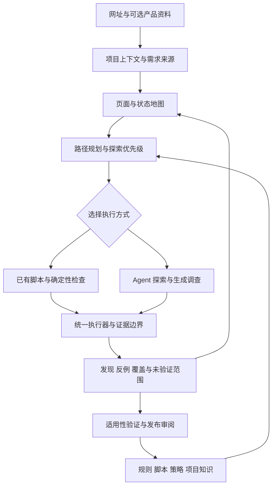

# UI Sentinel 产品目标与 Roadmap

更新日期：2026-10-06。现状基线：`main@88d63c0`。

UI Sentinel 的目标是成为能够理解产品、主动探索、验证问题，并将经验转化为自动化能力的 Web 质量 Agent。用户提供网址，以及可选的 PRD、Figma、业务说明和登录条件，系统就能规划检查、验证关键路径、发现设计缺陷与隐藏 bug，输出有依据、可复现的结果。

当前已经建立浏览器执行、调查工具、证据和有限规则学习闭环。距离上述目标，主要缺少陌生网站接入、产品理解、系统探索规划和通用自动化资产复用。下一阶段优先打通网址扫描的完整使用流程，再扩展需求接入和学习能力。

本文维护产品方向、现状差距和阶段出口。Roadmap 中的阶段均为待实施规划，不代表功能已经交付，也不承诺日历工期。具体任务在启动时拆入 `plans/`；完成后更新对应能力文档与本文状态，执行记录留在 Git 和本地验收资料中。

## 产品目标

产品围绕四项能力展开：

1. **理解产品并验证关键路径。** 从 PRD、Figma、业务说明等资料中提取角色、前置条件、操作路径、预期结果和允许失败分支，验证实际产品是否满足要求。
2. **发现 UI 和 UX 问题及隐藏 bug。** 复用已知规则，并主动探索规则未覆盖的交互、状态转换、恢复路径和体验问题。
3. **通过脚本降低时间与成本。** 将稳定的导航、状态准备、采样、判断和回归交给确定性执行，Agent 处理新情况、歧义与异常。
4. **将发现沉淀为可复用能力。** 从已验证问题中提炼规则、测量脚本、路径脚本、探索策略和项目知识，并持续验证其适用范围。

“自主扫描”意味着系统能够自行选择和完成有价值的检查。结论的信心来自需求依据、真实测量、复现和反例验证；没有发现问题不能等同于网站没有问题。

预期提供两种互补模式：

| 模式 | 输入 | 主要产出 | 判断边界 |
| --- | --- | --- | --- |
| 无资料探索 | 网址、允许范围、可选登录条件 | 页面与状态地图、通用检查、交互异常、体验建议 | 无法确认的业务预期保留为假设 |
| 有资料验证 | 上述输入，加 PRD、Figma、业务与角色说明 | 需求关联、关键路径结果、实现偏差、覆盖缺口 | 资料冲突或缺失时显式表达，不自动选择一个答案 |

两种模式都应区分违反明确要求、可复现功能缺陷和体验改进建议。报告同时给出检查范围与未验证范围，避免把局部测量扩大为全站判断。

## 当前架构与能力

当前采用 TypeScript、Mastra Core、Playwright、Midscene/Qwen、Hono、libSQL 和 React。产品是绑定 loopback 的受信单机服务，工作台和 API 同端口提供；任务在服务端串行执行，关闭工作台不会终止任务。

Agent 负责探索、语义绑定和提出假设；执行器负责工具调用、预算、业务写入限制、事实采集、证据完整性和最终收尾。运行状态由项目持久层管理。详见[当前架构](architecture.md)。

| 层次 | 已实现内容 | 当前边界 |
| --- | --- | --- |
| 工作台与服务 | 创建和取消任务、SSE 日志、历史报告、证据、反馈和候选操作 | 无多用户认证、远程 Worker 和分布式调度 |
| 业务契约 | 版本化要求、阈值、环境和写入额度；快照与 hash 随运行保存 | 接入陌生业务仍需要可信配置和适配器 |
| 页面执行 | 页面观察、元素引用、语义操作、视觉定位、预算和取消 | 当前观察变化后重新绑定；歧义目标不自动选第一个 |
| 规则检查 | 指针命中拦截、响应时间、业务反馈关联，以及获批声明式时序规则 | 内置规则覆盖有限；unknown 与不适用不算通过 |
| 未知问题调查 | 假设、原子时序采样、视觉聚焦探针、可组合 JSON 调查程序 | 有验证工具，尚缺系统化的全站探索规划 |
| 路径复用 | 从历史证据提取并重放 2–3 步只读点击片段 | 按契约身份隔离，不是完整业务流程自动化 |
| 证据与收尾 | 事件、截图、快照、测量、公开资源、程序回执和持久终态核验 | 未知写入不自动重放；未完成任务重启后中断 |
| 学习闭环 | 确认发现、生成声明、样本验证、人工批准、启用和复查 | 首次发布限于受限声明式规则，通用程序尚无发布闭环 |

两个业务已经共用同一执行器：购物 `checkout@1` 支持购物车准备、结账及结果检查；导出 `export@1` 支持选择参数、异步创建、查询、同一任务恢复和产物下载。业务适配器解释公开请求响应，输出统一业务事实，执行器不按业务名称或靶场编号分支。

当前原子时序调查默认开启，视觉输入区域发现与有限阻断审查默认关闭。视觉聚焦只验证输入区域的有界点击行为；可组合调查覆盖现有 DOM 测量原语能表达的问题，尚不支持任意视觉体验判断。具体边界见[执行层](execution-engine.md)、[视觉聚焦](visual-focus.md)和[可组合调查](composable-investigations.md)。

### 实现与验证的区别

当前能力已经有单元测试、真实浏览器测试、固定模型集成预检和真实模型验收入口。固定模型预检证明工具及服务能够协作，不证明 Agent 能自主发现问题；历史真实模型结果也不能自动代表当前构建或陌生网站上的表现。

生成程序中已经出现过错误预期和错误目标绑定：某些程序在异常页和健康页上都失败。后续可区分正常与异常的程序来自不同批次，不能拼接为一次完整矩阵通过。详见[生成程序的来源与状态](../evaluation/fixtures/generated-programs/README.md)及[评估协议](arena-and-evaluation.md)。

## 与产品目标的差距

| 目标 | 已有基础 | 核心缺口 | 判断 |
| --- | --- | --- | --- |
| 从资料提取并验证关键路径 | 契约、业务事实、结果校验、短路径片段 | 资料接入、需求关联、角色与状态模型、完整路径生成、测试数据准备 | 差距较大，当前预期主要由开发者编码 |
| 主动发现糟糕体验和隐藏 bug | 规则、假设、时序与视觉验证、通用 DOM 程序 | 页面与状态地图、探索策略、操作序列探索、风险排序和覆盖管理 | 局部能力已成立，通用扫描规划仍缺失 |
| 大量工作由脚本完成 | 确定性检查、原子采样、程序执行、短路径重放 | 前置状态准备、稳定重绑定、长流程、失败交接和脚本调度 | 方向成立，尚未成为主要执行方式 |
| 将发现沉淀为规则和脚本 | 有限候选生成、人工审阅和复查 | 适用性提炼、通用程序晋升、策略学习、修订与淘汰 | 有闭环雏形，通用资产生命周期待建设 |

### 陌生网站接入与完成标准

当前可靠业务判断依赖预先注册的契约和适配器。通用网址扫描需要项目级入口、域名范围、会话、允许操作及检查预算，并允许在缺少业务适配器时开展通用 UI 调查。

纯 UI 调查目前沿用业务完成契约，可能在调查完成后仍以 `blocked / business unknown` 收尾。未来应独立表达执行状态、检查范围完成度和业务结果：一次 UI 检查可以完成，同时明确业务流程不在范围内或仍未验证。

### 探索规划与判断依据

能验证一个问题，不代表 Agent 会主动检查到它。需要记录页面、关键状态、状态转换和未验证分支，根据价值、风险、证据缺口与预算选择下一步。

隐藏问题通常出现在操作序列中，例如填写后返回、切换选项后提交、失败后恢复、刷新后继续、重复点击后出现重复记录。扫描应有意识地探索这些转换，同时检查支持与反驳假设的证据。

产品事实、公开要求和模型推断需要分别保存。按钮不可点击本身不足以证明缺陷；必须说明它在当前条件下为什么应该可操作。程序执行成功也不能证明其预期合理。

### 可复用脚本的完整契约

现有调查程序是有界实验。长期复用还需要声明适用条件、前置数据、进入状态的方法、目标绑定、允许副作用、后置结果、失败交接和可选清理步骤。

稳定执行交给脚本，页面变化或出现新问题时交回 Agent。任何恢复都应知道哪些动作已经发生，不能因为脚本失败就重复业务写入。脚本化效果应同时衡量模型成本、维护成本、覆盖和误报漏报。

## 演进后的能力协作

下面是目标职责划分，不是已存在的新模块或 API。继续复用当前执行器、调查原语、规则和证据体系，在其上补充理解、规划与资产管理能力。

可复用资产需要分开管理，避免把页面细节或一次猜测提升为通用规则：

| 资产 | 回答的问题 | 例子 |
| --- | --- | --- |
| 规则 | 在什么条件下，什么行为应该成立 | 允许恢复且前置条件满足时，应有可操作的恢复入口 |
| 测量脚本 | 怎样取得足够可靠的事实 | 连续采样入口状态，记录命中与反馈时间 |
| 路径脚本 | 怎样到达需要检查的状态 | 创建测试数据并进入失败后的恢复页 |
| 探索策略 | 什么现象值得继续调查 | 异步内容出现后，检查关键操作是否仍可达 |
| 项目知识 | 该产品特有的要求或例外是什么 | 某类任务因审批流程暂时不可修改 |

资产应包含来源、版本、适用范围、验证样本、已知限制和状态。修订、失效与回滚可追溯；确认问题、保存程序、批准发布是不同事件。

## 分阶段 Roadmap

各阶段为建议实施顺序。资料接入和学习能力可以逐步建设，但阶段出口必须分别验证，不能用工具接线成功替代产品能力完成。

| 阶段 | 目标 | 主要依赖 | 状态 |
| --- | --- | --- | --- |
| R0 | 网址扫描与独立 UI 检查闭环 | 现有执行与证据体系 | 待实施，下一步编制实施方案 |
| R1 | 有覆盖依据的自主探索 | R0 的通用项目与报告 | 待实施 |
| R2 | PRD 和 Figma 驱动的路径验证 | R0 接入、R1 状态与路径模型 | 待实施 |
| R3 | 脚本优先执行与通用经验沉淀 | R1 探索、R2 预期与路径契约 | 待实施 |
| R4 | 增量回归与复杂交互扩展 | 可复用资产及可信效果指标 | 候选阶段，按收益选择范围 |

### R0 网址扫描闭环

让用户提供一个受支持的网址，就能完成通用 UI 检查并获得可用报告，无需为每个新网站开发业务适配器。

交付范围：

- 项目级网址、允许访问范围、预算与操作权限；会话接入先明确支持匿名页还是已有登录状态。
- 独立 UI 检查契约与结束语义，保留已有业务契约的验证能力。
- 基础页面观察、通用规则与现有调查工具的组合执行。
- 报告分别展示已检查内容、发现、证据、阻断原因和未验证范围。

阶段出口：使用未写专用业务适配器的独立站点，通过正式工作台/API 发起运行；正常与异常对照均有真实模型记录；UI 检查能显式结束且不伪造业务成功；不支持的交互有可见原因。已有购物、导出和证据完整性回归继续成立。

本阶段不要求任意站点、任意登录流程或任意视觉问题全覆盖。首次实现前冻结支持的网站与交互范围。

### R1 探索规划与覆盖管理

让 Agent 有依据地选择检查内容，并在预算内优先探索高价值状态。

交付范围：

- 页面、角色上下文、关键状态和状态转换的关联记录，区分访问过与验证过。
- 关键入口与路径识别，记录候选路径、前后置条件和未探索分支。
- 可复用探索策略：边界输入、返回与刷新、重复操作、状态切换、失败恢复等。
- 根据风险、覆盖缺口、重复观察和剩余预算调整计划；发现问题后主动寻找反例。

阶段出口：在需要多步操作才能触发问题的场景中，从中性任务产生有效调查；健康反例不被同一策略持续误报；报告可以追溯每项已验证范围的操作与证据。导航变化、目标歧义和预算不足时仍能明确交接或收尾。

### R2 产品资料与关键路径

让产品要求成为可引用、可验证的检查依据。

交付范围：

- 先接入 PRD 文本或文件，保存原始来源与版本；再接入 Figma 的设计结构和对应页面信息。
- 提取角色、前置条件、关键步骤、成功结果、合理拒绝和恢复要求。
- 将要求与实际页面、组件、状态及证据关联；对冲突、歧义和缺失要求显式保留问题。
- 为选定关键路径建立数据准备、允许操作、结果验证和未覆盖分支契约。

阶段出口：给定一份需求与对应产品，系统生成的路径和断言能回溯到具体要求；既能发现已知实现偏差，也能接受合理失败；资料变更后能指出受影响路径。Figma 检查应区分结构或交互偏差、设计例外与主观审美建议，不以截图差异直接判定缺陷。

### R3 脚本执行与经验沉淀

让首次探索产生经过验证的资产，后续运行优先复用这些资产。

交付范围：

- 脚本契约包含适用条件、前置状态、目标绑定、执行步骤、后置校验和失败交接。
- 稳定路径、重复采样和确定性断言优先脚本执行，异常再交回 Agent。
- 从已确认发现生成规则与脚本候选，在异常、健康、不适用和信息不足场景验证。
- 通用调查程序的保存、验证、批准和启用分离；支持版本、失效、回滚及修订记录。
- 学习项目合理例外和探索策略，避免把单个网站的行为推广成全局预期。

阶段出口：同一任务再次运行时能实际复用脚本，且有可比较的时间、调用与成本记录；文案或布局变化时能可靠重绑定或交回 Agent；不能重复已经发生的副作用。发布后的资产在独立正常/异常对照上成立，修订不能通过改变原预期来掩盖回归。

### R4 增量回归与复杂交互

在基础闭环稳定后，按用户场景和实测收益选择扩展方向，不要求一次实现全部候选能力。

优先考虑版本变化驱动的增量扫描、最小复现生成、跨视口与键盘体验、状态不变量检查。多角色协作和受控故障注入需要独立测试数据、会话及环境隔离能力，单独确定范围与验收。

阶段出口：在选定维度证明新增有效发现或减少检查成本，并保留覆盖缺口；增量扫描能说明为什么选择这些路径，定期与完整回归比较遗漏。复杂场景不得以牺牲现有证据、写入与结束边界换取表面通过率。

## 可扩展能力候选

以下为候选池，尚未承诺交付。选择时优先看它是否增加有效发现、提高可复现性或降低重复检查成本。

| 能力 | 典型检查 | 价值与依赖 |
| --- | --- | --- |
| 产品状态与覆盖地图 | 哪些页面和状态访问过，哪些断言真正验证过 | 为规划和报告提供依据，R1 基础能力 |
| 需求追踪与冲突发现 | PRD、设计稿与实现是否描述不同的允许行为 | 提供判断依据，依赖来源和版本管理 |
| 状态转换与序列探索 | 返回、刷新、切换、取消、重复提交后是否异常 | 发现单次点击无法暴露的问题，依赖状态与副作用记录 |
| 变化关系与不变量 | 排序不改变数量，保存后重开保持数据，导出与筛选一致 | 缺少完整答案时仍可验证关系，关系本身需有依据 |
| 多角色协作 | 创建者、审批者和查看者是否看到正确状态与权限 | 发现跨角色问题，依赖独立会话与共享业务状态建模 |
| 跨设备与无障碍体验 | 缩放、窄视口、键盘导航和焦点移动是否仍可完成任务 | 扩展真实用户体验覆盖，不能用少量检查宣称全面合规 |
| 受控故障与恢复 | 慢响应、断网、超时后是否丢数据、卡死或重复创建 | 适用于具备隔离条件的测试环境，干预来源必须可见 |
| 设计系统一致性 | 相同语义的表单、按钮与错误反馈是否一致 | 发现跨页面漂移，需要设计规范和合理例外 |
| 问题最小化与反例搜索 | 减少复现步骤，改变条件，寻找正常对照 | 提高可信度与修复效率，保留缩减失败记录 |
| 发布差异扫描 | 页面、需求或行为变化后优先检查受影响路径 | 降低重复成本，依赖版本映射与完整回归对照 |
| 项目设计意图学习 | 用户标记符合预期后，保存该例外的理由与适用范围 | 减少重复误报，资料变化后重新验证 |
| 脚本受约束修复 | 改版后重新绑定目标并验证原前后置条件 | 降低维护成本，不允许换目标或改预期来制造通过 |
| 复现与修复验证资产 | 为发现附带数据、前置状态、最小步骤和回归脚本 | 把探索成果延续到开发修复与发布验证 |

## 效果评估

产品成效以有效发现、覆盖透明度、复现能力和复用收益衡量。发现数量、截图数量、工具调用成功率或自报完成率不能单独代表质量。

| 维度 | 应记录的指标 | 解释边界 |
| --- | --- | --- |
| 发现质量 | 独立确认的有效发现比例、误报、已知缺陷漏报、合理拒绝误判 | 未标注的真实网站不能计算全站真实召回率 |
| 覆盖 | 已识别路径与状态中已验证、未验证和阻断的数量与原因 | 记录地图中的覆盖率不代表已经发现全部状态 |
| 可复现性 | 重放成功情况、目标与前置状态稳定性、证据完整性 | 一次成功不能证明稳定，重复次数在验收前固定 |
| 学习质量 | 新资产在健康/异常/不适用/unknown 对照中的表现 | 保存、生成或批准数量不能替代泛化效果 |
| 成本效率 | 时间、模型调用、已知与未知费用、脚本维护与失败交接成本 | 对比需固定任务、范围、预算、构建和模型配置 |
| 复用收益 | 首次探索与后续脚本运行的覆盖、质量和成本变化 | 减少调用但增加遗漏不算优化成功 |

每阶段先冻结样本、支持范围、重复次数与通过条件，再运行验收。真实模型与固定模型结果分开；开发集、回归集与未见场景分开；保留失败及未知结果，不拼接不同构建或不同批次形成通过结论。指标的数值目标在建立基线后确定，不预先虚构达成率。

## 下一步范围与暂缓事项

下一次交接任务是编制 R0 实施方案，产出 `plans/r0-url-scan-plan.md`，明确产品行为、代码影响、迁移兼容、实施顺序和验收矩阵。该任务是方案设计，R0 尚未开始实现。

第一个产品里程碑定义为：用户输入网址和可选简短目标，系统在声明的范围内完成 UI 调查，输出有证据的发现与覆盖缺口，且结束语义不依赖虚构业务成功。首版优先评估匿名网站、当前页面及有界同源导航、不会产生业务写入的交互；方案需说明此范围对动态网站可用性的影响，并明确静态资源、只读数据请求和导航的不同边界。随后在 R1–R3 逐步加入系统路径规划、资料依据和确认问题的复用检查。

开始实现前应在计划中明确首批网站与交互范围、匿名或已登录会话支持、允许的写入、报告完成语义和独立正常/异常样本。待这些选择确定后再估算工期。

近期继续沿用现有技术栈和执行边界。多用户平台、多机调度、插件市场、向量库、模型优化矩阵，以及任意生成代码的执行平台不作为上述里程碑的前置工作。主执行器职责较集中，新增能力时按理解、规划、执行和资产生命周期划分边界，随功能逐步拆分，不以全面重写启动路线图。

本文不替代[当前架构](architecture.md)、[规则与规则库](rules-and-rule-library.md)、[知识与上下文](knowledge-and-context.md)等实现说明。阶段完成时同步更新实现文档、测试依据与本文状态，避免目标能力和当前能力混写。

## 维护与交接约定

本对话中的维护 Agent 负责本文的现状、差距、阶段状态与下一次计划；方案 Agent 负责将当前里程碑转为可执行设计，实施 Agent 负责代码及验证交付。

每次代码更新交回维护 Agent 时，按以下顺序处理：

1. 对照实际提交或工作区差异、实现与验证记录，确认哪些能力已实现、哪些已验证、哪些仍受限；不能仅凭交付总结宣告阶段完成。
2. 更新本文的基线、能力差距、阶段状态和下一步范围，并检查相关当前能力文档是否一致。没有新增验收证据的能力保留未验证状态。
3. 判断当前阶段是通过、部分完成还是受阻；存在未完成的阶段出口时，优先给出补齐计划，不自动推进下一阶段。
4. 生成下一次交接提示词，包含目标、依据、范围、交付物和验收条件。阶段完成后遵循仓库约定，将长期结论并入 docs，移除已完成计划。

代码交付应提供提交标识或差异范围、相关计划、实际检查结果、证据位置及已知遗留项。收到更新后进行核对维护；本约定不表示已设置自动轮询或后台监听。
