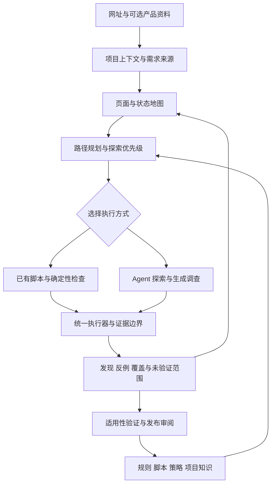

# UI Sentinel 产品目标与 Roadmap

R0离线依赖交付确认（2026-10-09）：已核对 `codex/r0-default-check-v2` 的交付提交 `556f241` 及[依赖交接](/Users/xietian/.codex/worktrees/r0-default-check-v2/ui-sentinel/plans/r0-r1-dependency-handoff.md)，隔离工作区干净，未推送/合并。当前约定的R0阶段交付与R1离线依赖提供工作完成：6个已有公开时点及输入、来源摘要、截止约束、两维义务和独立历史对照随分支保存，6份输入通过原R1解析器；来源为确定性provider驱动真实浏览器的既有轨迹，不是真实模型决策样本。R1已读到新包，正在自己的分支完成消费适配与免费核验，尚未宣告消费验收或Jev收益成立。R0停止扩展，不再等待原整套验收才启动R1；原正式真实模型/UI/业务及稳定性待办、历史持久故障和取消尾差异继续保留。此次维护只核对交接与会话状态，未重跑测试或调用付费模型。

R0→R1推进决定（2026-10-09）：用户明确要求R0以足以支持R1为当前出口，不再无限等待整套正式验收。R0接续交付 `5070fb2` 已完成限定内部阶段交付，产品候选 `27614b7`，28场景材料、38评分攻击和16报告回归已核对；持久风险、取消尾差异和未覆盖子项保留。已恢复「准备 Jev 探索验证计划」会话的免费工作，先做新版依赖接收、公开输入适配、一次程序基线、Jev请求dry-run和可判别评价设计。R0只追加最小依赖交接/公开状态包，复用既有固定时点事实，不新跑整批或强凑8状态；R1在自己的分支验收实际可消费性，不合并整条R0分支。当前R0对R1出口为“离线决策所需身份、两维义务、公开事实、来源截断和未知值可用”，不要求先完成原71任务或复现历史持久故障；正式通过状态仍不改写。未来接实时执行时按具体路径处理安全/持久前置，当前不启用S4、不调用模型、不自动授予付费。旧排序零分母保留，新的评价不得以任意合理选项命中冒充Jev排序收益；无可判别偏好时标平局，效率收益另需受控执行证据。本安排覆盖前文“R1一律暂停”的后续指令。

交付策略调整（2026-10-09）：用户提出“如果问题不大，先完成R0，后续遇到再针对解决”。已通知接续Agent收敛当前成果为有明确可用范围与已知风险的阶段性交付，完成正在编写的免费交接，不追加全量测试/偶发故障碰运气复现或付费。未覆盖子场景与已证产品缺陷分开分级；当前候选如存在已证错误成功、越权、动作重放或证据错误，仍阻断受影响能力，不能笼统称小问题。原seq49持久异常保留为未定位历史风险，保留失败隔离、不自动重放及捕获手段，不宣称已修复。取消报告迟到诊断尾事件按真实影响记录。阶段可交付与原正式真实模型验收分开，后者未运行/未通过状态不变；精简后续事项与触发条件随交付列出。新版免费覆盖仍有部分子项未验证，不将F01–F14全标闭合；用户调整不授权付费、默认启用、推送或合并。本条覆盖前文将所有剩余项都作为阶段交付前置的安排，不回写历史成绩。

接续更新（2026-10-09）：原R0开发会话发生 `context_length_exceeded`，追加“继续”仍失败；这不是应用扫描费用/预算错误。隔离 `codex/r0-default-check-v2` 已保存主体实现 `d978bc9` 及报告关联修正 `27614b7`，维护者核对时工作区干净，最终免费批次原始材料仍在，尚无最终交接/验收结论。已按用户明确授权新建干净会话「接续 R0 v2 免费验证与交付」（`01a11e10-e3be-7791-8882-354c7f64b980`），沿用原隔离工作区和分支，核对并复用现有证据，仅补缺项，不重做、不恢复付费。接续依据：[简短交接](../plans/r0-v2-context-recovery.md)。旧持久化故障仍开放，计划独立审阅待免费交付完成后开展。

推进更新（2026-10-09）：已核对[默认契约v2方案](../plans/r0-default-check-contract-v2-plan.md)及[机器索引](../plans/evidence/r0-default-check-contract-v2-plan.json)，按用户“他们都完成了，请继续”安排R0 Agent在从 `d636d7e` 派生的隔离 `codex/r0-default-check-v2` 分支开展D1–D6免费实现和F01–F14定向覆盖。实施基线为同一item的通用检查与有独立来源的必需效果两维；无规格通用完成必须披露功能未知，明确效果未验证仍阻止完成。新默认语义/未来评分使用新版本，不改写旧样本或成绩；本轮开发授权不包括真实模型、付费、推送或合并，持久故障仍开放，计划Agent留待交付后独立审阅。规则分支截图自扰已在本地因果对照中确认：默认截图6条样式变更、epoch0→2；caret initial为0条、epoch不变。实现 `46cc7c0`、交付 `c12b5b3`，8项定向检查及类型检查通过，仅实验采集/消费显式选择，其他调用默认不变，未公网复验。已安排规则Agent继续实现大文档中有界的目标可见性测量，保留透明遮盖、完整遍历/超限未知及原网络/证据门，不只提高600阈值；本轮不扩展语义绑定或重跑三页。当前两条开发线并行，DNS无新增任务、R1不扩展，旧公网0facts-ready仍是历史观测。

工作安排更新（2026-10-09）：已向现有「调研 R0 重复读取与检查遗漏」会话下达默认检查契约及未来验收方案任务，仅新增 `plans/r0-default-check-contract-v2-plan.md` 和对应机器索引，方案待审阅、不实施、不改历史标准。R0持久诊断暂无新假设，不追加重复运行；正式验收仍暂停。DNS独立交付 `b0174b1` 已在阿里DoH下取得固定三页DOM与截图，289条完成响应连接地址匹配，62项已有测试复用，无新增模型费用；22条策略拒绝及27条收口取消保留，不能称资源全加载。DNS已通过普通合并 `487dba2` 进入规则分支，图片实验交付 `f339343`：三页各两次观察，第二批58个目标、26个合同机器字段齐全、facts-ready为0，全部未做语义检查；组合构建通过。当前障碍包括大文档可见性未测、全局网络干预，以及可能由截图默认caret隐藏造成的DOM自扰；尚未证明所有epoch变化都源于截图。已向「实现限定版 UIK-D004 检查器」会话安排确定性单因素核验及实验截图最小修复，保留其他调用默认行为和所有失效/安全门；本轮不重访三页或扩展语义能力。DNS不追加开发，两项任务并行且不合入main/R0/R1。依据：[DNS交付](/private/tmp/ui-sentinel-network-dns-compat/plans/network-dns-compat-handoff.md)、[规则公网报告](/Users/xietian/.codex/worktrees/rule-image-proportion/ui-sentinel/docs/rule-library/image-binding-public-doh-validation.md)；均为本机独立工作区链接，未随本主工作区整合。

维护更新（2026-10-09，交付 `d636d7e`，诊断工具 `a3aa1bc`，产品仍为 `5f41285`）：[持久化专项交接](../plans/r0-persistence-repair-handoff.md)与[证据索引](../plans/evidence/r0-persistence-repair-delivery.json)交付默认关闭、有界的SQL/Client/事务/文件身份记录及首次失配捕获，8项诊断自检通过。同步点下的一条真实API/SDK/Chromium场景完成，184次独立读回一致；184是该场景内读回次数，不是184次扫描。并行worker使用隔离数据库，证明相应进程负载重叠，不证明同一数据库多进程写入竞争已覆盖。未定位历史触发原因、未改产品代码，原故障仍开放，不能以成功样本授予R0通过。建议结束无新假设的专项重复运行，保留现有捕获能力，在后续确有必要的免费开发/集成验证中显式按需启用；发生失配时停止并保留现场，不反复重放操作。逐点独立读取会影响时序，不得直接混入正式性能对照。下一项可独立推进的是默认检查契约的决策和可审阅方案，持久故障仍为正式验收准入待处理事项，不自动豁免或恢复付费。本次维护只读核对交接及会话，未重跑测试；费用新增0，R1不扩展。

维护更新（2026-10-09，交付 `e40a463`，产品候选仍为 `5f41285`）：[持久化与Filters跟进](../plans/r0-persistence-filters-followup.md)确认真实点击后的截图未登记，原库停在seq49且run仍running，终态与后续事件缺失；属于真实产品运行故障现象，具体触发原因未定。两次最小免费场景成功不能关闭原失败，也不能证明正常运行不受影响。原Filters输入没有明确效果规格，当前探索通路能够收集证据但不能核销原效果义务。后续建议分开推进：R0开发围绕首次遗失的产物登记、连接/事务及独立持久视图差异追查并定向修复；计划/验收工作明确未来默认政策中“通用交互检查完成”与“有规格的功能效果验证”两个维度。契约方向仅为建议，尚未获准实施；通用检查须保留适用规则、有效前后证据、真实异常发现与覆盖要求，有明确效果的必需事项不得降级，无规格的功能语义未知应在报告可见。若采纳，必须新版本、新冻结和对应验收，不能把原15/15与新语义直接等同，更不能改写历史失败。当前不推进单步影子付费实验：其结果无法解除上述两个阻塞；端到端真实验收仍不具备条件，R1不扩展。本次维护只读核对交接与机器索引，未重跑测试，未改产品、评分器或费用授权。

最新受限交付（2026-10-08，实现 `5f41285`、交付 `3bfecce`）：[探索效果交接](../plans/r0-effect-exploration-handoff.md)及[证据索引](../plans/evidence/r0-effect-exploration-delivery.json)确认原实现存在后续只读测量无法回连原事项、无关后置断言误核销事项两处缺口。新通路复用既有入口，允许一次已选本地点击探索，保持原事项pending，再读取实际反馈并关联原action/item进行只读测量；未知预期不能据实际输出反造。当前仅支持操作前冻结、字面来自原用户目标的文字预期，不证明原网址默认入口中的Filters已具备完整验证路径。交付记录为14个浏览器反例、66项定向测试和5项未知写入/取消回归；14例使用的构建与最终候选相差旧UI关联的unknown总故障门，最终构建仅对受影响legacy-related补验，不能称全部14例在最终构建重跑。一次并行验证的terminal-history/tail持久化核对失败仍未定位，串行成功不消除该问题。本次维护只读核对文档、关键实现和失败日志，未重跑验证；新增付费0，R0未通过、批次不恢复。下一步由R0 Agent有界核对该失败的发生条件及正常运行影响，并依据原公开输入明确默认Filters义务的可验证范围；如仍缺独立预期，应提交具体契约缺口，而非追加隐藏规格后宣称原样本修复。完成这两项后才评估最小真实Agent验证，不直接恢复整批验收；R1不扩展。

最新路径分析（2026-10-08，`4ee2cee`）：[Filters可行性分析](../plans/r0-filters-path-feasibility.md)确认按钮及原pending事项已知，尚缺公开效果关联；可以提出针对性读取，但不能据现有前缀确认完整效果验证路径。已知结果槽支持post-action绑定；未知结果槽的先行探索及随后关联原事项尚缺实际接口证明。代码中的调查程序分支存在独立动作处理，不能仅凭普通click要求verify就宣布运行时完全不可行。下一步是免费确定性接口验证，区分“获准探索动作”“取得新事实”“依据成立的效果验证”“核销原事项”；不以焦点/body存在等占位断言通过，不从实际结果反造预期。该结论收窄了调研方向，未证明模型无能力，也未授予R0通过；R1继续暂停。

最新补充（2026-10-08，交付 `2ac24ef`）：DOM分页定位影子对照6/6执行，A/B各3次；B3/3检索原8.0，A0/3，首屏重读A1/3、B0/3，按预定标准取得局部支持信号。A含1次供应商限流失败，有效决策A2/B3；A另有合理定向查询，重复是否无理由未确定。B均检索原JSON回执而非直接DOM翻页，未执行工具，不能据此证明完成率或稳定提速。缓存及服务差异保留为限制。新增费用USD0.00780618，共享累计2.11661055、余额17.88338945，unknown/held/lease均0；批次关闭。产品候选仍为 `c1d41e1`，R0原失败保持。依据：[完整结果](../plans/r0-dom-locator-shadow-results.md)。下一步应聚焦公开事实如何支持Filters的操作及后置验证，不扩大记忆改造或恢复整批验收；R1保持本轮收尾。

前序状态快照（截至 `4ee2cee`；最新状态以上方维护更新为准）：DOM分页定位修复候选 `c1d41e1`，保留 `b266089` 请求级费用停止修复；交付记录确认DOM相关20/20及类型检查通过，原费用41项复用，8状态包保持不变。保护范围为共享网关，独立R1及直连路径不自动继承。原产品候选 `08acc95` 真实诊断仍为计划6行、执行3行：1通过、2质量失败、3未运行；费用核清未恢复批次。正式UI及K5未启动，R0未完成。R1最新本地交付 `cd38877`，离线建议实现 `66d1896`：8状态均有建议、7状态多候选，4状态符合开发参照、4未知，完整执行路径全部未知。没有可可靠区分优先次序的参照，本轮停止，不准备Jev请求；旧完整准入零分母结果保留，Jev调用0、无S4接入，阶段验收未完成。最新依据为[DOM定位修复交接](../plans/r0-dom-locator-free-handoff.md)及[费用停止与状态包交接](../plans/r0-request-stop-free-handoff.md)；原真实验收结论见[R0真实验收交接](../plans/r0-08acc95-final-handoff.md)。

UI Sentinel 的目标是成为能够理解产品、主动探索、验证问题，并将经验转化为自动化能力的 Web 质量 Agent。用户提供网址，以及可选的 PRD、Figma、业务说明和登录条件，系统就能规划检查、验证关键路径、发现设计缺陷与隐藏 bug，输出有依据、可复现的结果。

当前已经建立浏览器执行、调查工具、证据和有限规则学习闭环，并实现默认关闭的匿名有界网址扫描入口及独立 UI 结束语义。距离上述目标，主要缺少经真实模型验证的网址扫描效果、产品理解、系统探索规划和通用自动化资产复用。首轮真实诊断暴露了目标失效后的恢复与收尾问题，下一步优先核验 R0 整改闭环，再开展新批次能力验证。

本文维护产品方向、现状差距和阶段出口。阶段状态区分代码实现、集成验证与真实能力验收；后续规划不代表功能已经交付，也不承诺日历工期。具体任务在启动时拆入 `plans/`；完成后更新对应能力文档与本文状态，执行记录留在 Git 和本地验收资料中。

## 产品目标

产品围绕四项能力展开：

1. **理解产品并验证关键路径。** 从 PRD、Figma、业务说明等资料中提取角色、前置条件、操作路径、预期结果和允许失败分支，验证实际产品是否满足要求。
2. **发现 UI 和 UX 问题及隐藏 bug。** 复用已知规则，并主动探索规则未覆盖的交互、状态转换、恢复路径和体验问题。
3. **通过脚本降低时间与成本。** 将稳定的导航、状态准备、采样、判断和回归交给确定性执行，Agent 处理新情况、歧义与异常。
4. **将发现沉淀为可复用能力。** 从已验证问题中提炼规则、测量脚本、路径脚本、探索策略和项目知识，并持续验证其适用范围。

“自主扫描”意味着系统能够自行选择和完成有价值的检查。结论的信心来自需求依据、真实测量、复现和反例验证；没有发现问题不能等同于网站没有问题。

预期提供两种互补模式：

| 模式 | 输入 | 主要产出 | 判断边界 |
| --- | --- | --- | --- |
| 无资料探索 | 网址、允许范围、可选登录条件 | 页面与状态地图、通用检查、交互异常、体验建议 | 无法确认的业务预期保留为假设 |
| 有资料验证 | 上述输入，加 PRD、Figma、业务与角色说明 | 需求关联、关键路径结果、实现偏差、覆盖缺口 | 资料冲突或缺失时显式表达，不自动选择一个答案 |

两种模式都应区分违反明确要求、可复现功能缺陷和体验改进建议。报告同时给出检查范围与未验证范围，避免把局部测量扩大为全站判断。

## 当前架构与能力

当前采用 TypeScript、Mastra Core、Playwright、Midscene/Qwen、Hono、libSQL 和 React。产品是绑定 loopback 的受信单机服务，工作台和 API 同端口提供；任务在服务端串行执行，关闭工作台不会终止任务。

Agent 负责探索、语义绑定和提出假设；执行器负责工具调用、预算、业务写入限制、事实采集、证据完整性和最终收尾。运行状态由项目持久层管理。详见[当前架构](architecture.md)。

| 层次 | 已实现内容 | 当前边界 |
| --- | --- | --- |
| 工作台与服务 | 创建和取消任务、SSE 日志、历史报告、证据、反馈和候选操作 | 无多用户认证、远程 Worker 和分布式调度 |
| 业务与检查契约 | 业务要求、阈值、环境和写入额度；独立 ui-scan 契约；快照与 hash 随运行保存 | 通用 UI 检查不需要业务适配器，可靠业务结果判断仍需要可信配置与适配器 |
| 网址扫描 | 匿名 HTTP(S) 入口、有界同源导航、资源与数据访问范围、检查账本和独立结束证明 | 默认关闭；不支持登录、POST 查询等维度；真实模型能力验收待完成 |
| 页面执行 | 页面观察、元素引用、语义操作、视觉定位、预算和取消 | 当前观察变化后重新绑定；歧义目标不自动选第一个 |
| 规则检查 | 指针命中拦截、响应时间、业务反馈关联，以及获批声明式时序规则 | 内置规则覆盖有限；unknown 与不适用不算通过 |
| 未知问题调查 | 假设、原子时序采样、视觉聚焦探针、可组合 JSON 调查程序 | 有验证工具，尚缺系统化的全站探索规划 |
| 路径复用 | 从历史证据提取并重放 2–3 步只读点击片段 | 按契约身份隔离，不是完整业务流程自动化 |
| 证据与收尾 | 事件、截图、快照、测量、公开资源、程序回执和持久终态核验 | 未知写入不自动重放；未完成任务重启后中断 |
| 学习闭环 | 确认发现、生成声明、样本验证、人工批准、启用和复查 | 首次发布限于受限声明式规则，通用程序尚无发布闭环 |

两个业务已经共用同一执行器：购物 `checkout@1` 支持购物车准备、结账及结果检查；导出 `export@1` 支持选择参数、异步创建、查询、同一任务恢复和产物下载。业务适配器解释公开请求响应，输出统一业务事实，执行器不按业务名称或靶场编号分支。

`ui-scan` 同样复用该执行器，通过 `EXECUTION_URL_SCAN=1` 启用。默认最多 3 个页面或路由、1 条导航边深度；检查结果使用 covered/partial/not-started，业务结果为 not-applicable。检查账本已经记录候选、选中目标与实际验证证据，但下一步选什么仍主要由 Agent 决定，尚无程序主导的通用交互遍历与可靠复原机制。

当前原子时序调查默认开启，视觉输入区域发现与有限阻断审查默认关闭。视觉聚焦只验证输入区域的有界点击行为；可组合调查覆盖现有 DOM 测量原语能表达的问题，尚不支持任意视觉体验判断。具体边界见[执行层](execution-engine.md)、[视觉聚焦](visual-focus.md)和[可组合调查](composable-investigations.md)。

### 实现与验证的区别

当前能力已经有单元测试、真实浏览器测试、固定模型集成预检和真实模型验收入口。固定模型预检证明工具及服务能够协作，不证明 Agent 能自主发现问题；历史真实模型结果也不能自动代表当前构建或陌生网站上的表现。

R0 首次 C 层诊断在 `8adc93a` 上执行：smoke 接通，首个健康样本运行 300 秒后超时，另外五条未运行。实际排序成功，但没有完成交互验证、后续导航和显式收尾；不能据此宣称六个样本全部失败，也不能将无 finding 当健康通过。取消请求的费用未知触发批次停止，后续费用核对没有恢复该批次。

`8b73e3f` 补充目标失效原因与恢复提示、上下文摘要、数值顺序校验和评分器目标归属修复。交付记录包含全量及接线验证结果；本次维护核对报告、原始事件、审核结果与代码差异，不把这些记录替代重新执行的独立验收。修复后 C 未运行，R0 仍未完成。旧失败及未运行行保持原结论，不能用新源码或评分器重写历史结果。

上述修复后未复验是首轮交接时的历史状态。后续已进行诊断02–09：诊断04、06、07各为4/6，08与09各为5/6，使用不同冻结构建，不能汇总成同构建通过率。08唯一失败是私有判定未识别有效名称排序证据；09唯一失败是模型提前将未尝试事项记录为无绑定永久 gap。D20/D21 分别修订判定与计划记录入口，该候选随后进入诊断10，结果见下文收敛建议。本次核对依据[推进记录](../plans/r0-final-acceptance.md)与提交，未重新执行其测试或付费批次。

生成程序中已经出现过错误预期和错误目标绑定：某些程序在异常页和健康页上都失败。后续可区分正常与异常的程序来自不同批次，不能拼接为一次完整矩阵通过。详见[生成程序的来源与状态](../evaluation/fixtures/generated-programs/README.md)及[评估协议](arena-and-evaluation.md)。

## 与产品目标的差距

| 目标 | 已有基础 | 核心缺口 | 判断 |
| --- | --- | --- | --- |
| 从资料提取并验证关键路径 | 契约、业务事实、结果校验、短路径片段 | 资料接入、需求关联、角色与状态模型、完整路径生成、测试数据准备 | 差距较大，当前预期主要由开发者编码 |
| 主动发现糟糕体验和隐藏 bug | 规则、假设、时序与视觉验证、通用 DOM 程序 | 页面与状态地图、探索策略、操作序列探索、风险排序和覆盖管理 | 局部能力已成立，通用扫描规划仍缺失 |
| 大量工作由脚本完成 | 确定性检查、原子采样、程序执行、短路径重放 | 前置状态准备、稳定重绑定、长流程、失败交接和脚本调度 | 方向成立，尚未成为主要执行方式 |
| 将发现沉淀为规则和脚本 | 有限候选生成、人工审阅和复查 | 适用性提炼、通用程序晋升、策略学习、修订与淘汰 | 有闭环雏形，通用资产生命周期待建设 |

### 陌生网站接入与完成标准

当前可靠业务判断依赖预先注册的契约和适配器。通用网址扫描已经允许在缺少业务适配器时开展匿名 UI 调查，并冻结入口、访问范围与预算。更广泛的会话接入、动态网站兼容性和真实探索效果仍需分别验证或扩展。

纯 UI 调查已经独立表达执行状态、检查范围完成度和业务结果。有已验证缺陷仍可以完成检查，业务结果为 not-applicable；未验证条目和执行器干预必须保留。业务模式继续沿用原业务完成契约。完成所选检查不证明全部页面状态已经被发现或验证。

### 探索规划与判断依据

能验证一个问题，不代表 Agent 会主动检查到它。需要记录页面、关键状态、状态转换和未验证分支，根据价值、风险、证据缺口与预算选择下一步。

隐藏问题通常出现在操作序列中，例如填写后返回、切换选项后提交、失败后恢复、刷新后继续、重复点击后出现重复记录。扫描应有意识地探索这些转换，同时检查支持与反驳假设的证据。

产品事实、公开要求和模型推断需要分别保存。按钮不可点击本身不足以证明缺陷；必须说明它在当前条件下为什么应该可操作。程序执行成功也不能证明其预期合理。

### 可复用脚本的完整契约

现有调查程序是有界实验。长期复用还需要声明适用条件、前置数据、进入状态的方法、目标绑定、允许副作用、后置结果、失败交接和可选清理步骤。

稳定执行交给脚本，页面变化或出现新问题时交回 Agent。任何恢复都应知道哪些动作已经发生，不能因为脚本失败就重复业务写入。脚本化效果应同时衡量模型成本、维护成本、覆盖和误报漏报。

## 演进后的能力协作

下面是目标职责划分，不是已存在的新模块或 API。继续复用当前执行器、调查原语、规则和证据体系，在其上补充理解、规划与资产管理能力。

可复用资产需要分开管理，避免把页面细节或一次猜测提升为通用规则：

| 资产 | 回答的问题 | 例子 |
| --- | --- | --- |
| 规则 | 在什么条件下，什么行为应该成立 | 允许恢复且前置条件满足时，应有可操作的恢复入口 |
| 测量脚本 | 怎样取得足够可靠的事实 | 连续采样入口状态，记录命中与反馈时间 |
| 路径脚本 | 怎样到达需要检查的状态 | 创建测试数据并进入失败后的恢复页 |
| 探索策略 | 什么现象值得继续调查 | 异步内容出现后，检查关键操作是否仍可达 |
| 项目知识 | 该产品特有的要求或例外是什么 | 某类任务因审批流程暂时不可修改 |

资产应包含来源、版本、适用范围、验证样本、已知限制和状态。修订、失效与回滚可追溯；确认问题、保存程序、批准发布是不同事件。

## 分阶段 Roadmap

各阶段为建议实施顺序。资料接入和学习能力可以逐步建设，但阶段出口必须分别验证，不能用工具接线成功替代产品能力完成。

| 阶段 | 目标 | 主要依赖 | 状态 |
| --- | --- | --- | --- |
| R0 | 网址扫描与独立 UI 检查闭环 | 现有执行与证据体系 | 08acc95诊断1通过/2失败/3未运行；探索完成稳定性不足，请求级unknown停止待修；正式UI/K5未启动 |
| R1 | 有覆盖依据的自主探索 | R0 的通用项目与报告 | Jev/S0及限定纯规划模块免费交付完成；真实协议、评分、执行闭环与产品验收未完成，默认关闭 |
| R2 | PRD 和 Figma 驱动的路径验证 | R0 接入、R1 状态与路径模型 | 待实施 |
| R3 | 脚本优先执行与通用经验沉淀 | R1 探索、R2 预期与路径契约 | 待实施 |
| R4 | 增量回归与复杂交互扩展 | 可复用资产及可信效果指标 | 候选阶段，按收益选择范围 |

### R0 网址扫描闭环

让用户提供一个受支持的网址，就能完成通用 UI 检查并获得可用报告，无需为每个新网站开发业务适配器。

交付范围：

- 项目级网址、允许访问范围、预算与操作权限；会话接入先明确支持匿名页还是已有登录状态。
- 独立 UI 检查契约与结束语义，保留已有业务契约的验证能力。
- 基础页面观察、通用规则与现有调查工具的组合执行。
- 报告分别展示已检查内容、发现、证据、阻断原因和未验证范围。

阶段出口：使用未写专用业务适配器的独立站点，通过正式工作台/API 发起运行；正常与异常对照均有真实模型记录；UI 检查能显式结束且不伪造业务成功；不支持的交互有可见原因。已有购物、导出和证据完整性回归继续成立。

本阶段不要求任意站点、任意登录流程或任意视觉问题全覆盖。首次实现前冻结支持的网站与交互范围。

#### 首轮诊断后的整改重点

健康排序替换列表节点后，原调查保留节点身份并返回 unknown；此证据边界正确。问题在于旧回执未解释失效原因，Agent 随后反复读取 DOM、历史和同一回执，消耗剩余时间。新增恢复提示是必要修复，但还需证明可以完成后续验证与收尾。

下一轮重点检查：

- 将操作控件绑定与结果测量分开。点击前绑定控件，页面更新后重新读取公开 DOM，再显式绑定结果节点；需要跟踪同一节点变化的调查继续保留节点身份约束。不能悄悄将旧目标重绑定，也不能将后置状态检查扩大为缺乏前置证据的前后比较。
- 新测量与原未验证事项的关系。明确关联原动作、新观察、后置测量与原检查项，并核对同 run、页面/状态、动作顺序、目标归属、预期适用性和证据完整性。旧 unknown 保留审计；只有足以满足原要求的新证据才能解决相应义务，不能因另建成功检查就清空 gap。若现有接口无法表达，先明确契约再修复；恢复测量不自动重放原动作。
- 有界恢复与收尾。在现有防循环机制中识别同一页面状态、证据和读取位置的无新增信息重复；要求刷新相关事实、重新测量或记录原因后 partial 收尾，为收尾预留时间。新相关证据仍允许继续调查，不能禁止必要的历史读取。部分完成可避免无效超时，但不能替代健康样本的完整通过。
- 正式 API 级恢复验证。覆盖动作替换目标、重新观察、有效后置检查、后续导航和 accepted finish，另有歧义、错误目标与不可恢复反例。仅证明第二个程序能计算 pass/fail 不足以证明运行闭环完成。
- 真实模型复验。先将原失败用于已见回归诊断，再使用独立保留场景开展新批次；每批单独冻结和授权，不拼接结果。`holdout-grid-1` 已用于修复依据，不能继续作为未见样本。

审核 Agent 补充的费用核对作为独立验收基础设施事项：请求取消且缺少 usage 时保留费用预留，利用可获得的 generation ID 查询最终费用，核对请求与提供方归属，并追加可追溯、幂等的核对记录。有效结算后累计额度不再重复计算该项预留与实际费用；原 unknown 事件保持不变。缺少 ID、元数据未就绪或无法核对时继续保守停止，查询应有界，不能无限轮询。

费用查明只解除相应费用不确定性，不改变任务失败、补齐未运行样本或自动恢复已结束批次，也不扩展既有授权。它不能修复模型恢复循环；前三项执行衔接与正式 API 级验证为本轮产品整改重点。当前没有充分证据要求更换模型或直接增加任务时限，先验证这些衔接再评价模型能力。

Jev 决策模块可继续在隔离工作区开展前置设计与离线实现，但不能替代上述恢复修复，也不混入本次 R0 整改验收。

#### 多轮诊断后的收敛建议

诊断10在同一候选 `26e5d91` 上完成：三个健康样本完整结束且无误报，两个异常样本完整结束且各有独立回放核实的有效发现；边界样本实际为 `interrupted / reconciliation-required`、持久状态 `not-final`、无有效结束证明。原评分6/6漏查终态，追加复核为5/6，整批不通过。原结果保留；正式 UI15 与业务 C 尚未开始。本次维护依据报告、复核记录与相关源码，未重跑浏览器或付费验收；报告中的独立方法复核由同一 Agent 执行，不等同换人盲审。

[状态契约专项分析](../plans/r0-state-contract-convergence.md)已将 D1–D21 归并为七条契约，并用免费实际 API / SDK / Chromium 探针确认当时的缺口。后续整改单元围绕以下要求实施：

- K1 请求归属：UI 拒绝且未派发的请求不能被共享监听器误记为未知业务写入，更不能因此隔离后续正常任务；实际派发且结果未知的业务写入仍必须隔离，禁止自动重放。
- K2 可信收尾：普通允许请求不能证明站点阻塞；真实干预在排除未知派发、完成相关证据落库后，由确定性路径结束并保留未验证范围。取消、执行异常和真实未知写入不能被 partial 掩盖；历史读取必须重新校验 blocker 的真实性、归属及先后顺序。
- K3 边界评分：同时核对终态、真实 finish、持久证明、先行 blocker、无到站写入及无污染误报，不能只凭 partial 字段判通过。旧 C10 及 interrupted、cancelled、伪 blocker 反例均须拒绝。

首个整改候选 `835b11a` 免费自测通过，但另一 Agent 发现取消已被 API 受理后，旧终态仍可提交并导致错误隔离，故独立复核否决。受限修复 `97d39ed` 将启动、取消受理和终态提交放入同一运行的串行仲裁，真实未知业务写入仍优先隔离。原复核 Agent 确认上轮 P1 闭合，K1–K3 关键契约受限范围通过，无新阻塞项，见[交付说明](../plans/r0-cancel-order-handoff.md)与[独立复核](../plans/evidence/r0-cancel-order-review.json)。

本轮新增免费定向测试、API/Chromium B30及原K1–K3 B18通过；B30来自10次运行的顺序、后续任务、重启和SQLite核对，不是30次独立模型运行。复核者另跑10项并核对原始数据库。其余回归按源码和构建映射复用前轮证据，未声称1499项全部在新提交重跑。本次文档维护核对交付和复核记录，没有再次运行测试。本轮付费调用0。

随后在恢复授权下执行 `97d39ed`：C11六行诊断全部通过，正式UI固定15行全部执行、13行通过，未满足15/15出口。健康8/9、异常5/6满足完整标准；健康行均无supported误报，异常失败行仍有有效遮挡发现。K5业务诊断5及正式45未启动。本轮执行与原始材料审查没有宣称另一个Agent重新复核全部C证据；维护者仅核对交付与分析，没有重复运行测试。

[专项分析](../plans/r0-k4-formal-failure-analysis.md)区分两类剩余问题：F1健康页排序已验证，但反复读取后未履行已选控件和导航义务，正确有界收尾仍不等于健康完成，属于探索稳定性缺口；F2只读probe被遮挡时返回的预期阴性结果，被宽泛UI异常分支当成致命执行错误，属于错误分类的相邻实现缺口。原取消仲裁等受限复核仍成立，不能外推为所有UI动作路径均通过。

F1/F2现已在 `e13c535` 完成受限修复，见[交接说明](../plans/r0-f12-handoff.md)及[独立复核](../plans/evidence/r0-f12-review.json)。F2复用原观察节点身份，以trial与当前几何交叉证据确认完全拦截，阴性结果关联原事项并保留发现；正面probe只证明可点击性，不代替真实动作效果。失效目标、取消、真实故障与未知写入仍按原契约处理。F1仅给已选pending事项一次有界引导机会，不制造证据、不重置循环计数、不扩大权限，不能证明真实模型一定采纳。

首版 `e30a9ef` 独立否决的节点重新绑定窗口、引用截图完整性两项缺口已修复并复查闭合。当前候选单元63/63、probe专项26/26通过，26项来自11次API/浏览器执行、4项证据反例及11项重启对照，不能称为26次独立任务。未改的F1、生命周期与业务边界按影响范围复用原证据；复核者另跑2文件4项并检查原反例。旧单场景复现脚本仍带34行汇总断言，原exit1保留，专项判定明确记录其限制，不冒充整批通过。本次维护只读取交付与复核记录，没有重跑测试。

该修复轮费用0，完整原始材料在本地 `data/r0-f12-delivery-evidence.tar.gz`，不随Git推送。随后恢复授权执行新候选，实际结果见下文。原13/15和首版否决均保留，不拼接成绩；只读阴性仍限于可证实的完全拦截，复杂几何与暂态情况保守处理。

本轮C花费US$0.28082808，共享US$20护栏剩余US$18.17222396，unknown与预留均为0；余额不自动授权失败后的补丁或新批次。完整原始包在本地 `data/r0-k45-delivery/r0-97d39ed-c11-and-formal01.tar.gz`，未随Git推送，远端复核须另交付。当前布局已见，不作为未见网站泛化证据。单进程仲裁、未穷尽崩溃交错和终态所有权记录积累的内存事项继续保留。任何新候选按冻结阶段验证，不能拼接本轮13条通过；旧C10、835b11a和本轮失败均保留，R0不提前标为完成。

开发时在稳定的已见场景上做定向回归；只有准备作独立能力判断时才启用新保留集。样式或布局变化不能单独证明广泛泛化。现有正式 UI 和业务出口仍有效，若要把研发推进与完整发布验收拆开，应明确各自允许的行为与完成声明。

#### e13c535真实诊断及交付结论

新批次 `r0-ui-diagnostic-e13c535-01` 六行全部执行，5/6，smoke通过。三健康完整完成且零supported误报；遮挡异常完整完成且发现有效，真实轨迹中F1引导和F2阴性probe均生效；边界可信blocked。排序异常有独立有效发现，但后续 `page_act {type:"navigate", ref:"e25", url:null}` 缺少导航地址，派发前拒绝落入致命UI执行异常分支，已选导航未完成，无有效结束证明。没有派发该导航、没有未知写入，也不是旧节点恢复或遮挡测量再次失败。

报告将其归为模型工具选择/参数稳定性问题，同时定位实现边界：动作专属必填参数未在派发前统一校验，缺参和真正执行故障混用终止路径。后续 `adc6b54` 对click/probe/fill/navigate/scroll及嵌套调查动作统一校验必填字段与组合，在浏览器操作和动作计账前拒绝无效输入，进入既有一次有界工具修正通道。重复错误不叠加F1引导、不解决原待办；不猜URL或替换动作，真正执行故障、取消和未知写入保留原语义。

该修复构建通过，定向57项、业务边界5项、API/SDK/Chromium8场景通过，原始SQLite与产物自审计一致。证据包含无操作拒绝窗口、修正后click及navigate、已选链接须点击、重复拒绝收尾、取消和真实click故障。最初交付是开发自测与同Agent核对，索引 `separateAgentReview=false`；后续候选只读复核已接受，随后进入下述真实批次，不将最初自测追写成盲审。兼容变化包括fill必须显式提供value（空串表示清空）、scroll必须显式提供scrollY、不再接受互斥或多余字段；类型合法不代替运行时权限和目标验证。该修复轮费用0，不能以固定模型自测推导真实模型必然修正成功。

正式UI0/15、业务诊断0/5、业务正式0/45均为未准入，不是运行失败。原始证据审计一致不等于质量通过；本次由执行Agent作独立方法核对，不声称另一Agent盲审。新增费用US$0.08724984，共享累计US$1.91502588、余额US$18.08497412，含历史账本总费用US$1.95225048；unknown/held/lease均0。原始包在本地 `data/r0-e13c535-final/r0-e13c535-diagnostic-final-evidence.tar.gz`，不随Git推送。未自动补丁或重跑。

应用可作为匿名、有界同源扫描的实验版本试用，启动和历史报告读取见[最终交接](../plans/r0-e13c535-final-handoff.md)。有效发现与完整完成分别报告；partial或execution-error不等于网站无问题。K4/K5正式标准不因试用而豁免。

#### adc6b54真实诊断：范围增补与结束时机

`r0-ui-diagnostic-adc6b54-01`六行全部执行，5/6，smoke通过：健康2/3、异常2/2、边界1/1。失败的dom-healthy已验证Name排序及实际链接导航，返回目录后又选择新文档中的Price检查，但未执行后置测量，272.857秒进入时间收尾保留区。原Price事项pending且预算缺口保留，blocked/partial有有效持久证明，仍不满足健康完整完成。该行无validationErrors、action:failed、contractRepair或F1事件，不能归因为参数修复回退或引导续期。

异常排序行出现一次多定位字段拒绝，模型自然修正后完整完成并保存有效发现，说明字段反馈有真实成功轨迹；不代表整体稳定性通过。正式UI0/15、业务诊断0/5、业务正式0/45均未准入。本轮新增US$0.10388787，共享累计US$2.01891375、余额US$17.98108625，含历史账本共US$2.05613835；unknown/held/lease均0。原始包位置和摘要见[交付索引](../plans/evidence/r0-adc6b54-final-delivery.json)，未随Git推送。维护者仅核对交付记录，没有重跑验收。

后续设计提交 `89326cd` 已完成[范围准入与结束时机契约草案](../plans/r0-scope-admission-finish-contract.md)，[原前缀复算](../plans/evidence/r0-scope-finish-prefix-review.json)确认第4行seq176时原完成函数接受scope-covered，无缺少义务；两个pending均未选。该复算没有执行seal或提交，临时proof丢弃，不能改写历史5/6。对照第2行seq273，原门也接受，但验收要求的筛选尚未登记，说明自动收尾必须先解决公共必需范围与scope的对应，不能直接以旧门ready为唯一触发。

草案提出必需来源先于预算、可选准入后义务不可撤销、实时预算覆盖必需剩余工作及扩展上界与收尾保留，以及执行器拥有的closing栅栏复用原seal/重判/证明/提交。后续接口调查确认：原公开goal和url-scan-1只有有界采样，展开筛选的额外要求仅存在于私有评分器。这是产品与验收契约差异，不能继续当作已有公开义务的遗漏接线。

`b5dd38c` 新增公开API `requiredChecks`，由请求方明确提供入口页selector、动作及适用后置条件，冻结到契约hash并登记原scope；登记/绑定/验证缺失不能完成。7文件92项、同构建API/浏览器9场景（1创建拒绝、8运行）通过，原始自审计核对132件材料，本轮费用0；维护者仅阅读交接与接口，未重跑。两个历史对照使用了新显式声明，不能视为旧中性任务已被修复或改写旧5/6。

`b5dd38c`交付时的边界：仅显式提供requiredChecks时启用新closing和扩展准入，缺省保持旧路径；空数组也表示调用方声明完整，不能用它假定隐含目标已覆盖。当时工作台没有声明入口，普通“网址＋文本目标”不使用新收尾，因此仅能作为显式检查清单的API执行底座。后续默认入口修复见下文。自由扩展因缺乏可信成本上界继续保守拒绝，不证明预算内自主扩展能力。

后续提案 `37ec687` 已明确[默认入口对齐方案](../plans/r0-default-entry-alignment.md)：版本化 `bounded-ui-sampling-1` 对普通表单和API由服务器统一安装，用户仅填网址及可选目标。每个实际访问页从首批最多8候选中冻结min(3,N)个合格本地控件，N≤3全部纳入；全程有合法同源候选时实际点击验证一条链接，观察、适用规则及已选事项均保留。目标用于关注重点，不承诺完整自然语言需求编译；未选、截断、未访问和参数变体如实列为未检查。失败不换样、重访不重置样本，不用空requiredChecks冒充来源闭合。

维护建议接受此方向并进入受限实现，无需再扩写计划。实现时固定首批候选顺序、页面身份和选择承诺点，不能由重观察或重访重抽样；高级追加与默认样本只在义务等价时共享完成证据，同一控件不同后置要求不得吞并，计数仍按原不同控件上限。新版本只作用于新任务，历史缺少该revision的报告保持原契约。登记来源、测量、closing与持久证明共用原scope/finish，不新增另一套宽松完成门。

该提案现已在 `08acc95` 实施（运行时主提交 `5cd2640`）。新任务使用 `url-scan-default-3` 和 `bounded-ui-sampling-1`，工作台实际表单不含selector、检查脚本或空requiredChecks。首次干净观察冻结最多8候选，并在额度内保留一个可用同源导航；≤3本地控件全部纳入，>3先固定三项再执行。重访同完整路由不重采，追加义务不删除，默认来源闭合后走原closing。旧url-scan-1/scope-2按原契约读取和执行，不追溯安装新政策。

免费证据为84个不同定向测试（83项与协议5项中4项重叠）及同构建12/12 API/SDK/Chromium场景，包含普通工作台创建→报告→历史恢复、选样与失败不换样、早退拒绝、可靠收尾、追加/重访、取消和真实故障。交付者只读核对12个运行及202件材料；这是同Agent自审计，不称另一Agent盲审。维护者读取交接和索引，未重复测试。早期失败和构建不一致尝试保留，未计入最终分母。

未来验收工具已使用 `ui-default-sampling-2`，从首次原始公开快照独立重建候选池和冻结分母，避免漏登记后缩小N。五个既有样本本地控件为2/3/3/2/2，通用政策纳入排序与筛选；离线重放三个健康场景通过，漏掉Apply的反例被拒绝。异常有效发现、正式15/15、工作台入口及原业务门槛保持，旧失败不重评分。实际默认能力仅为原生可见启用候选的有界采样，不承诺任意自然语言目标、自定义组件、动态状态或全部参数组合。

该免费交付费用0，当时共享累计US$2.01891375、余额US$17.98108625，历史另账US$0.03722460保留。完整本地证据在 `data/r0-default-entry-delivery/r0-default-entry-evidence.tar.gz`，不随Git推送。后续冻结提交 `bc67d7f` 建立新协议manifest，取得恢复授权后执行了下述唯一诊断批次，未复用旧approval。

#### 08acc95新协议真实验收：义务调度与请求级停止

最终交付 `7926b4d`：UI诊断计划6行，实际3行，1通过、2质量失败、3未运行；后续正式UI15、业务诊断5和正式45均未启动，共71任务执行3、未运行68。第1行健康目录3动作/5模型、119.912秒完整完成，closing阻止扩展；第2行健康overlay3动作/11模型、256.889秒，重复填Sort后筛选及链接仍pending；第3行异常overlay0动作/7模型、269.953秒，停留只读工具并出现60秒请求超时。两条partial未被当成成功，第3行有效自动遮挡发现保留，但不抵扣检查未完成。没有发现需重开范围登记或持久证明全部实现的证据；固定模型免费通过没有证明真实义务调度稳定性。

另有明确验收工具缺口：请求进入费用unknown后约1秒，网关仍接纳了原配置的自动重试，费用US$0.00449526。reservation只查总额，runner在下一行checkpoint才停止，未满足请求级unknown优先停止。该重试完整计入24个请求及费用；后来对原generation核对并追加结算不改变这项违规，也不恢复批次。再次付费前必须先闭合共享请求入口、重试及停止传播的免费反例，不能只把重试设0掩盖网关缺口。

本轮新增US$0.08989062，共享累计US$2.10880437、余额US$17.89119563，加历史另账后R0共US$2.14602897；当前有效unknown/held/lease均0，无running stage。原始包 `data/r0-08acc95-resume/r0-08acc95-real-acceptance-evidence.tar.gz` 在本地，未推Git；交付者原始数据库/产物及配对重放核对不宣称另一Agent盲审，维护者没有重跑。诊断1/6不能解释为六行都运行后五行失败，也不能与旧5/6直接比较为回退。

下一工作分开：先免费修复请求级费用停止；再用已保存的重复填框/只读/长推理轨迹，界定已登记义务的优先执行、前置事实及重复调查限制。closing只解决何时结束，不能替代完成剩余义务。后者与R1调度能力相邻，应只收敛R0所需的最小执行策略，不盲目合并R1或再堆单句提示。策略需保留真实新证据调查、原权限和后置测量，不以自动乱点、降低默认采样或扩大时限取得通过；新真实验证前需明确可检验的改进假设与范围。

### R1 探索规划与覆盖管理

让 Agent 有依据地选择检查内容，并在预算内优先探索高价值状态。

交付范围：

- 页面、角色上下文、关键状态和状态转换的关联记录，区分访问过与验证过。
- 关键入口与路径识别，记录候选路径、前后置条件和未探索分支。
- 可复用探索策略：边界输入、返回与刷新、重复操作、状态切换、失败恢复等。
- 根据风险、覆盖缺口、重复观察和剩余预算调整计划；发现问题后主动寻找反例。

阶段出口：在需要多步操作才能触发问题的场景中，从中性任务产生有效调查；健康反例不被同一策略持续误报；报告可以追溯每项已验证范围的操作与证据。导航变化、目标歧义和预算不足时仍能明确交接或收尾。

#### 纯规划模块的当前交付

2026-10-08，接收开发提交 `1233e03`，经 `f565eec` 有界收尾，文档tip为 `979b08f`。本地R1工作区干净，尚未push，未合入R0。依据该分支的 `plans/r1-service-exploration-closeout.md`、`plans/r1-roadmap-status-update.md` 和 `artifacts/r1-service-exploration/closeout-f565eec/verification.json` 登记，维护者未重跑测试。

`src/agent/exploration/` 已提供限定的纯规划能力：页面/文档/相关状态/视图身份、路径和未检查分支投影、attemptId到原检查事项及真实证据引用的关联、未知/在途动作不重放、状态内重复与恢复上限、风险排序及公平轮转，以及受候选与预算约束的fill/back/refresh高层意图。边界输入只支持有结构化公开max-length依据的情况，其他复杂约束交回Agent。高层意图不授予执行权限；运行级计数须由调用方持续持有，checked投影须来自inspection-host，不能把观察当验证。

本次9文件124项定向测试及类型检查通过；干净实现提交上的6状态dry-run、14叶文件校验通过，真实模型调用0。此前Jev和S0证据复用，不累加测试数冒充新候选全量验证。六项修订中包含撤销不成立的费用硬上界标记，外部依据并未因此补齐。首次失败日志保留；上述artifacts为本地材料，不随Git自动传递，跨机器交接需另附。

近期先完成下述8状态最小决策实验，S4执行接入继续暂停。恢复S4时仍需冻结唯一执行器的权限、预算、取消、状态版本及“动作—事项—后置测量—证据”关系，再在隔离集成分支验证实际页面；不能以纯模块测试或静态选项比较替代产品闭环。

#### 8状态最小决策实验的免费准备

最新离线建议收尾（`cd38877`，实现 `66d1896`，覆盖下方早期状态）：`r1-offline-advice-1`已分离建议与实时执行准入，原冻结材料不改。8状态均生成调查建议、7状态多候选；S02/S04/S05/S06符合开发参照，另外4状态未知，独立参照未复核，完整执行路径全部未知。可接受集合及现有事实无法可靠区分多候选次序，故没有可验证“排序改善”的状态；这不是Jev无收益或程序足够的结论，也不要求唯一正确候选。新增10项定向测试和类型检查通过（按交付登记，维护者未重跑），模型/浏览器调用0、无S4接入。接受本轮停止，不继续通过补标签、改排序规则或追加接线来制造正分母。当前模式只能评价调查对象建议，不能检验具体工具选择、后置验证构造或读取次数减少；同等质量下的速度收益也尚未测量。后续研发优先回到R0已有DOM游标A/B这一具体可区分机制；该6请求影子对照后续已授权执行并关闭，结果见本文最新补充；不自动恢复71任务验收。

最新接收结果（`5283e9e`）：8/8来源、截断点与原契约核对通过；完整准入过滤因permission/preconditions未知及缺动作时间/美元上界，8状态全部交回，排序有效分母0、Jev请求0。原选择3/8能精确映射click，其余fill/页面级/批量读取仍未知。此结果暴露实验将离线建议范围与实时执行准入混用，不能证明程序足够或Jev无收益；开发参照一致性不等于独立质量验证。下一步建议单独版本化离线建议协议：输出值得继续检查的候选、已有依据和待补前提，不授予派发许可；真实执行仍由原执行器验证。禁止将unknown改yes、未知美元改0或删除真实语义前提来制造合格分母。保留本次0分母结果，先完成免费比较，再决定是否存在值得调用Jev的状态；历史精确映射与新策略的可评价范围分别报告。

R0 DOM局部修复（`c1d41e1` / `b69c0cf`）已交付：省略回执保留原查询、分页及结果引用，超长查询明确省略而不截断CSS；免费20/20、类型检查通过，原请求记忆6576→6643字节且关键状态不变。静态B只恢复原三个定位字段；未调用真实模型或浏览器，未修改8状态包，不能回填晚于S06截止的8.0回执。该受限任务可收尾，6请求单因素对照后续已完成，取得局部支持信号；不立即恢复整批R0验收。

独立诊断补充（2026-10-08）：[历史提效与R0失败诊断](../plans/independent-root-cause-diagnosis-2026-10-08.md)将主要疑点收窄为“把已知待办转成有依据、可验证的下一步”的使用摩擦，尚不能单独归因为模型能力或架构回归。健康overlay第二次修改Sort是为后续数值排序验证准备状态，不能仅凭动作重复判定失忆或无理由重复。第11请求的DOM回执8.0确实被压缩为omitted/resultRef，未保留原查询和nextOffset；维护者抽查原请求确认该局部损失，但它不能解释所有长推理。历史Jev收益来自业务阻断收尾，当前UI未启用；两失败行仍收到待办。新事实读取可被计为进展而义务未推进，是需调查的保护触发局限，不登记为已确认计数缺陷。

因此R1静态评价须区分“选对控件”与“存在可执行且可验证的下一步”：Filters后置条件不明时，不能仅以选中Filters判为推进；有依据的继续读取、probe或说明缺失前提可以是合理结果。人工参照应识别为后续检查准备状态的必要动作，避免将其误标为无理由重复。不得要求Jev替执行器制造后置条件或证据。诊断另提出只恢复DOM分页定位信息的6请求影子对照，它仅测试局部重读机制，尚未授权或执行，不自动加入当前8状态批次；可先免费核对字段来源及单因素差异。

2026-10-08，R1本地实现 `19bd357`、交付提交 `0b47557`；工作区干净，交付说明为未push。维护者读取 `plans/r1-decision-pilot/README.md`、`DELIVERY.md` 及 `artifacts/r1-decision-pilot/preparation-19bd357/` 的验证索引和原始测试日志，未重跑测试。新增14项合成接线测试、复用1项独立unknown费用停止测试及类型检查通过；该停止测试在R1独立路径中证明24项队列只派发1次，不继承R0的停止保证。真实Jev调用0，未修改R0或接入默认流程。

已准备程序过滤与排序、单候选免调用、请求编译、字段映射和冻结评价协议。当前只有3个合成接线样例，历史选择unmapped、Jev not-run，不能判断真实决策收益。真实导出接收后，先冻结来源、决策截断点、历史选择和允许多个合理答案的人工参照，再比较历史实际选择、纯程序、程序加Jev。历史选择未映射的指标必须保留未知；当前仅支持click/inspect，不能将fill或其他动作强行转换后宣称覆盖原失败。需显式报告8状态中可比较、多候选及范围外的分母。

R0已随 `b266089` / `b4e0973` 正式冻结交付8状态，原R1契约解析8/8通过；R1仍需接收并映射到新增pilot契约，解析通过不代表人工参照或可比较性完成。公开包不含历史选择评价，评价包独立保存；参照依据当时公开事实冻结，新决策固定后再比较原选择。R1可立即核对字段和证据来源并运行免费程序基线，无须等R0正式通过；纯程序已足够时按协议停止，不为使用Jev追加请求。真实调用草案0–8次、总支出意愿上限USD0.25，不是费用硬上界或授权。实际候选数决定每请求2N+1道题；问题数量支持范围、费用预留依据和具体请求清单仍待补齐。兼容性首请求拟复用于质量比较，不默认额外追加原六状态smoke。静态选择只能提供进一步研究信号，不能证明整轮扫描耗时、覆盖或完成率改善；真实协议、探索闭环和R1阶段验收仍未完成。

#### Jev 承担常规探索决策的验证项

状态：原前置模块 `bfe31a5` 提供候选契约、排序、预算、缓存、交回机制及22个离线开发种子；真实提供方适配器与免费评价工具于 `c47f496` 交付。S0评分遗漏在 `80d0f99` 定向修复，交付记录确认派发与费用账本完整对应、语义交回由原始响应重算，30项定向测试及局部类型检查通过，复用原181+55项和干净复验证据。以上记录已经接受，不再将两项旧评分缺口列为待修。真实Jev调用仍为0，24个开发状态标签为作者草稿，独立保留集与标注复核尚缺；协议、判断质量及整轮收益均未验证，新调度和Jev探索维持默认关闭。

下一步S1补齐问题数量与费用预留依据，当前smoke配置仍为 `questionsVerified=false`、`billingBoundVerified=false`、`quoteUsd=null`。6状态dry-run不等于6次真实兼容性试跑；具备依据并取得对应冻结批次授权后才调用，兼容通过再进入S2评分实验。该线可与S4契约及纯程序接线独立推进。所有实验不改变R0候选与评分，不继承其通过声明或费用授权。R1分支来自脱敏导出树，只移植约定模块及工具的变更，不能整分支合并或覆盖主仓库。

分层结论：Jev/S0和本批限定纯规划及准备工具的免费开发完成；真实协议验证、评分实验、探索闭环及R1阶段验收均未完成。分支内 `plans/r1-completion-plan.md` 将S5提出为12类场景、三组各2轮的72次有界对照；这是后续计划，尚未执行或由本次登记授权，须先冻结场景、通过条件与逐行费用。Jev无收益时保留负结论并停止本轮调优，产品出口合格的非Jev能力可独立交付；第三组未运行须明示缺项并另行裁定阶段范围，不能自动豁免。

目标是在保持发现质量与覆盖的前提下，让 Jev 替代大量主 Agent 的逐步动作决策，降低整轮扫描时间和成本。

当前 Jev 仅用于可选的业务阻断收尾判断，ui-scan 不走该审查分支。拟验证的用法将 Jev 放到高频的“下一步检查哪个控件”环节；它应实际替代主模型调用，而不是在原有每轮调用之前再加一层评分。

建议流程：

1. 主 Agent 根据任务制定检查方向与范围，例如检查目录页的筛选、排序和展开区域。
2. 程序枚举公开可交互目标，采集文本、角色、位置、几何、当前状态和相关历史。可由 DOM 或已有测量确定的信息直接使用，不再交给模型猜测。
3. Jev 回答有界问题：该操作是否可能暴露未检查内容、与任务是否相关、是否可能提供新信息，或从程序给出的可执行候选中选择下一项。
4. 程序结合 Jev 评分、状态记忆、几何线索、预算和恢复成本选择动作，执行后重新测量，记录实际结果。有可靠恢复条件时执行恢复并验证，随后继续局部扫描。
5. 候选不足、判断不确定、预测与实际明显不符、无法恢复，或需要多步业务理解与新调查程序时，交回完整 Agent。

先验证“Jev 对候选评分、程序排序”，便于区分候选遗漏、语义误判和调度问题；后续再比较“Jev 直接选择下一动作”。对同一状态可将多个问题放入一次请求，按有效状态缓存结果；缓存必须随相关状态变化失效。点击可能同时展开内容、更新页面并导航，不将这些效果强行视为互斥类别。

几何测量与部分候选账本已经存在。新增工作重点是决策输入、调度、动作后状态差异、按状态去重、恢复验证和交回 Agent 的条件。Jev 的预测不能直接证明实际点击效果、操作权限或站点缺陷；所有动作、测量、预算和结束仍使用统一执行边界。低分不能永久排除目标，应保留探索低优先级候选和连续操作的预算，避免只覆盖容易预测的交互。

首轮实验限制在菜单、折叠、标签切换等有界局部交互，比较三组：当前 Agent 调度、纯程序启发式调度、程序加 Jev 调度。使用相同样本、任务、预算上限及判定标准，固定模型配置并记录全部失败。纯程序组用于区分收益来自调度本身还是 Jev 的语义决策。

验收重点：主 Agent 调用实际减少多少，Jev 调用和交回 Agent 的开销是多少，以及整轮成本与耗时是否下降。同时记录有效且不重复的发现、误报漏报、状态覆盖、恢复失败和预算耗尽；不能仅用 Jev 单次费用低、响应快或点得更多证明方案更优。实验前约定质量与覆盖的容许变化及收益门槛，不事后降低标准。达到门槛后再建议扩大适用范围，否则保留结论并调整或停止该方向。

样本必须覆盖正常滚动与故意裁切、低优先级或中央控件、需连续操作才出现的问题、无法可靠恢复的状态。靠近边缘是线索；视口外、矩形重叠或新增 DOM 本身不等于缺陷。恢复需核对相关 UI 和业务前置状态，不能将后退、刷新或复制 DOM 当成通用回滚。

### R2 产品资料与关键路径

让产品要求成为可引用、可验证的检查依据。

交付范围：

- 先接入 PRD 文本或文件，保存原始来源与版本；再接入 Figma 的设计结构和对应页面信息。
- 提取角色、前置条件、关键步骤、成功结果、合理拒绝和恢复要求。
- 将要求与实际页面、组件、状态及证据关联；对冲突、歧义和缺失要求显式保留问题。
- 为选定关键路径建立数据准备、允许操作、结果验证和未覆盖分支契约。

阶段出口：给定一份需求与对应产品，系统生成的路径和断言能回溯到具体要求；既能发现已知实现偏差，也能接受合理失败；资料变更后能指出受影响路径。Figma 检查应区分结构或交互偏差、设计例外与主观审美建议，不以截图差异直接判定缺陷。

### R3 脚本执行与经验沉淀

第二轮图像候选绑定（`330c5ba`，仍在独立规则分支）：新增独立实验入口，自动枚举最多32个主文档原生图片，采集页面/视口、定位及唯一性、节点身份、资源URL/SHA、观察与证据。人工仍选择candidateId并提供intent、依据位置/正文和confirmedBy；字段自动留空，不推断保形义务。候选按会话与观察绑定，五分钟过期、重新观察、DOM/目标/资源变化及证据缺失或篡改均拒绝旧确认；会话关闭后仅留历史材料。新增9场景加复用31绘制测试共40/40及类型/格式检查通过（按交付登记，维护者未重跑），实际合成导出样本已核对。未修改共享执行接口或R0，未接R1、合并、推送或付费调用，默认关闭。人工指定对象后的检查通路已具备实验入口，但陌生页面适用率、频繁失效成本和自动语义判断尚未验证。下一步优先评估少量真实页面的可测比例及人工负担，不继续扩展确认后台或绘制范围；全页DOM变化即失效是当前保守策略，不视为未来通用规则的永久要求。

前置交付登记（2026-10-08）：规则知识库从356条Jira二次摘要归并23条候选，仍不代表运行时验证或启用。独立分支 `codex/rule-image-proportion` 以 `212bdf9` 保存知识库基线，`01fb867` 实现首个限定图像候选；未合并或推送。维护者读取实现、接线差异和交付文档，未重跑测试。D010关联已有overlay-blocking 2.1.0，不新增重复检查。D004新增默认关闭的image-shape-distortion 0.1.0，依赖调用方提供页面、唯一目标、视口、资源SHA及保形依据，测量静态PNG/JPEG的object-fit与二维内容变换；四态报告及证据下载已有合成夹具接线。交付记录为57项免费定向测试及类型/格式检查通过，不代表原Jira复现或陌生网站泛化。

该候选完成的是“明确要求及目标后，确定性判断CSS非等比变形”。尚未完成只输入网址后的自动图片发现与语义适用性建立，公共UI/学习审批接口也未接收这类合同；confirmedBy为调用方声明而非系统审批证明。源图本身错误、SVG/复杂绘制及真实站点覆盖保持未支持或未知，工程分辨区间不当作普适设计标准。接受为限定测量能力候选，不授予默认启用资格，不改变R0冻结候选。后续重点应是降低目标与资源绑定的人工成本、明确语义依据来源及验证实际覆盖，不优先扩建复杂绘制支持或审批平台。

让首次探索产生经过验证的资产，后续运行优先复用这些资产。

交付范围：

- 脚本契约包含适用条件、前置状态、目标绑定、执行步骤、后置校验和失败交接。
- 稳定路径、重复采样和确定性断言优先脚本执行，异常再交回 Agent。
- 从已确认发现生成规则与脚本候选，在异常、健康、不适用和信息不足场景验证。
- 通用调查程序的保存、验证、批准和启用分离；支持版本、失效、回滚及修订记录。
- 学习项目合理例外和探索策略，避免把单个网站的行为推广成全局预期。

阶段出口：同一任务再次运行时能实际复用脚本，且有可比较的时间、调用与成本记录；文案或布局变化时能可靠重绑定或交回 Agent；不能重复已经发生的副作用。发布后的资产在独立正常/异常对照上成立，修订不能通过改变原预期来掩盖回归。

### R4 增量回归与复杂交互

在基础闭环稳定后，按用户场景和实测收益选择扩展方向，不要求一次实现全部候选能力。

优先考虑版本变化驱动的增量扫描、最小复现生成、跨视口与键盘体验、状态不变量检查。多角色协作和受控故障注入需要独立测试数据、会话及环境隔离能力，单独确定范围与验收。

阶段出口：在选定维度证明新增有效发现或减少检查成本，并保留覆盖缺口；增量扫描能说明为什么选择这些路径，定期与完整回归比较遗漏。复杂场景不得以牺牲现有证据、写入与结束边界换取表面通过率。

## 可扩展能力候选

以下为候选池，尚未承诺交付。选择时优先看它是否增加有效发现、提高可复现性或降低重复检查成本。

| 能力 | 典型检查 | 价值与依赖 |
| --- | --- | --- |
| 产品状态与覆盖地图 | 哪些页面和状态访问过，哪些断言真正验证过 | 为规划和报告提供依据，R1 基础能力 |
| 需求追踪与冲突发现 | PRD、设计稿与实现是否描述不同的允许行为 | 提供判断依据，依赖来源和版本管理 |
| 状态转换与序列探索 | 返回、刷新、切换、取消、重复提交后是否异常 | 发现单次点击无法暴露的问题，依赖状态与副作用记录 |
| 变化关系与不变量 | 排序不改变数量，保存后重开保持数据，导出与筛选一致 | 缺少完整答案时仍可验证关系，关系本身需有依据 |
| 多角色协作 | 创建者、审批者和查看者是否看到正确状态与权限 | 发现跨角色问题，依赖独立会话与共享业务状态建模 |
| 跨设备与无障碍体验 | 缩放、窄视口、键盘导航和焦点移动是否仍可完成任务 | 扩展真实用户体验覆盖，不能用少量检查宣称全面合规 |
| 受控故障与恢复 | 慢响应、断网、超时后是否丢数据、卡死或重复创建 | 适用于具备隔离条件的测试环境，干预来源必须可见 |
| 设计系统一致性 | 相同语义的表单、按钮与错误反馈是否一致 | 发现跨页面漂移，需要设计规范和合理例外 |
| 问题最小化与反例搜索 | 减少复现步骤，改变条件，寻找正常对照 | 提高可信度与修复效率，保留缩减失败记录 |
| 发布差异扫描 | 页面、需求或行为变化后优先检查受影响路径 | 降低重复成本，依赖版本映射与完整回归对照 |
| 项目设计意图学习 | 用户标记符合预期后，保存该例外的理由与适用范围 | 减少重复误报，资料变化后重新验证 |
| 脚本受约束修复 | 改版后重新绑定目标并验证原前后置条件 | 降低维护成本，不允许换目标或改预期来制造通过 |
| 复现与修复验证资产 | 为发现附带数据、前置状态、最小步骤和回归脚本 | 把探索成果延续到开发修复与发布验证 |

## 效果评估

产品成效以有效发现、覆盖透明度、复现能力和复用收益衡量。发现数量、截图数量、工具调用成功率或自报完成率不能单独代表质量。

| 维度 | 应记录的指标 | 解释边界 |
| --- | --- | --- |
| 发现质量 | 独立确认的有效发现比例、误报、已知缺陷漏报、合理拒绝误判 | 未标注的真实网站不能计算全站真实召回率 |
| 覆盖 | 已识别路径与状态中已验证、未验证和阻断的数量与原因 | 记录地图中的覆盖率不代表已经发现全部状态 |
| 可复现性 | 重放成功情况、目标与前置状态稳定性、证据完整性 | 一次成功不能证明稳定，重复次数在验收前固定 |
| 学习质量 | 新资产在健康/异常/不适用/unknown 对照中的表现 | 保存、生成或批准数量不能替代泛化效果 |
| 成本效率 | 时间、模型调用、已知与未知费用、脚本维护与失败交接成本 | 对比需固定任务、范围、预算、构建和模型配置 |
| 复用收益 | 首次探索与后续脚本运行的覆盖、质量和成本变化 | 减少调用但增加遗漏不算优化成功 |

每阶段先冻结样本、支持范围、重复次数与通过条件，再运行验收。真实模型与固定模型结果分开；开发集、回归集与未见场景分开；保留失败及未知结果，不拼接不同构建或不同批次形成通过结论。指标的数值目标在建立基线后确定，不预先虚构达成率。

## 下一步范围与暂缓事项

当前暂停真实验收：共享网关请求级unknown停止已由 `b266089` 完成受限修复和免费定向验证；DOM定位候选及静态对照也已由 `c1d41e1` 交付。R1离线建议边界已厘清，本轮因参照缺少排序辨别力停止；DOM游标影子对照现已完成并关闭；下一步核对Filters从公开事实到操作及后置验证的可行路径，不继续扩建排序实验。不因费用核清自动恢复批次，不继续无改进假设地重复整条71任务流程。复用已有有效证据，不全面重开已接受模块；R0当前是可实验试用但完成稳定性未通过的版本。R1可在隔离环境研究既有接口和最小调度依赖，不据此授予正式集成资格，共享网关之外的调用方不能继承请求级停止保证，新候选业务回归也未因此获证。未来验收协议如需调整须显式说明并冻结，旧失败及15/15等既有出口不自动改写；任何新实现和付费范围以用户继续指令为准。

第一个产品里程碑仍是：用户输入网址和可选简短目标，系统在声明的范围内完成 UI 调查，输出有证据的发现与覆盖缺口，且结束语义不依赖虚构业务成功。首版采用匿名网站、当前页面及有界同源导航、受限交互，静态资源、只读数据请求和导航各有边界。动态网站可用性的限制需保留在验收与报告中。随后在 R1–R3 逐步加入系统路径规划、资料依据和确认问题的复用检查。

R0 真实验收前确认冻结构建、配置、样本、次数、通过条件与费用上限。后续阶段启动前再明确其支持范围和阶段出口，避免把新探索策略导致的收益归入旧构建的验收结果。

近期继续沿用现有技术栈和执行边界。多用户平台、多机调度、插件市场、向量库、模型优化矩阵，以及任意生成代码的执行平台不作为上述里程碑的前置工作。主执行器职责较集中，新增能力时按理解、规划、执行和资产生命周期划分边界，随功能逐步拆分，不以全面重写启动路线图。

本文不替代[当前架构](architecture.md)、[规则与规则库](rules-and-rule-library.md)、[知识与上下文](knowledge-and-context.md)等实现说明。阶段完成时同步更新实现文档、测试依据与本文状态，避免目标能力和当前能力混写。

## 维护与交接约定

本对话中的维护 Agent 负责本文的现状、差距、阶段状态与下一次计划；方案 Agent 负责将当前里程碑转为可执行设计，实施 Agent 负责代码及验证交付。

每次代码更新交回维护 Agent 时，按以下顺序处理：

1. 对照实际提交或工作区差异、实现与验证记录，确认哪些能力已实现、哪些已验证、哪些仍受限；不能仅凭交付总结宣告阶段完成。
2. 更新本文的基线、能力差距、阶段状态和下一步范围，并检查相关当前能力文档是否一致。没有新增验收证据的能力保留未验证状态。
3. 判断当前阶段是通过、部分完成还是受阻；存在未完成的阶段出口时，优先给出补齐计划，不自动推进下一阶段。
4. 生成下一次交接提示词，包含目标、依据、范围、交付物和验收条件。阶段完成后遵循仓库约定，将长期结论并入 docs，移除已完成计划。

代码交付应提供提交标识或差异范围、相关计划、实际检查结果、证据位置及已知遗留项。收到更新后进行核对维护；本约定不表示已设置自动轮询或后台监听。
