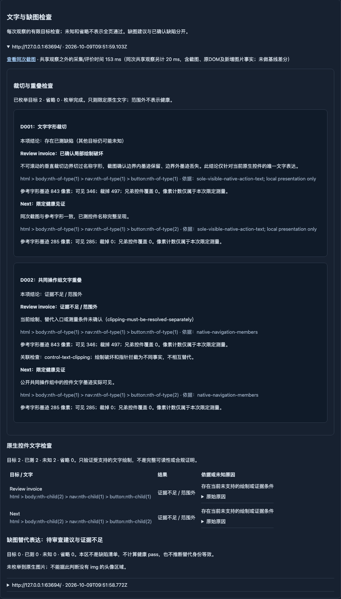

# D001 / D002 普通扫描交付

2026-10-09（Asia/Shanghai）。**两条限定规则及普通网址扫描接线已完成，建议维护者按本范围审阅合入；没有已知交付阻塞。** 普通用户仍只输入网址和可选目标，已开启的 ui-scan 自动测量并展示可读发现、同次截图、未知/省略范围和历史报告。没有新增实验操作要求、付费模型、全局开关或业务规则。

## 版本与工作区

- 源分支：`codex/rules-clipping-overlap`，实现提交 **`4983896226b4f977d8dc153e630283e98c46ac7e`**。
- 开发/整合基线 main：**`280bcd54ebe36f3d22f8e1c06fa47c14f79516cd`**；交付前 main 仍为此 SHA。
- 旧分支 `codex/rule-image-proportion` 保留在 `723185ea62141239de38546d621c1cd7bb6d3f3b`。现场原 worktree 已被移除，本轮在原路径 `/Users/xietian/.codex/worktrees/rule-image-proportion/ui-sentinel` 从指定 main 新建上述分支，没有重置旧分支或删除数据。
- 沿路径 `/Users/xietian/.codex/AGENTS.md` 为空，仓库未发现其他适用 AGENTS.md。未在主目录或 main worktree 开发；未修改 Roadmap、R1、DNS、模型/费用/调度代码。
- 本交付文档/索引是实现提交之后的收尾提交；最终整合应包含二者。用 `git log -1 --format=%H -- docs/rule-library/rules-clipping-overlap-delivery.md` 获取文档交付完整 SHA。

[机器证据索引](evidence/rules-clipping-overlap-20261009.json)保存10项源码摘要、候选 server/工作台构建摘要、准确运行结果、报告及原始材料位置。最终产品验证直接运行上述实现，收尾仅有文档及 `layout-facts.ts` 一处链式表达式的换行/缩进修正，无语义变化；索引同时保留实际测试源码摘要和交付格式摘要。

## 两条规则实际检查什么

| 规则 | 可自动成立的限定依据 | fail 的测量条件 | 实测健康条件 |
| --- | --- | --- | --- |
| D001 / `control-text-clipping` 0.1.0 | 当前原生 button/a 的唯一纯文字名称；只判断局部操作名称字形，不要求所有页面文字完整 | 不可滚动 `overflow:clip` 的垂直边界实际切过字形；同次截图与参考裁切模型一致；至少4个丢失墨迹像素及4个仍可见墨迹像素 | 参考字形与同次截图一致，全部已测墨迹可见，即使 Range 矩形越过容器边界也可以 pass |
| D002 / `control-text-overlap` 0.1.0 | 同一个公开 nav/fieldset/role=toolbar 中，同父、独立启用、名称不同的原生控件应作为共同操作组呈现；支持 static/relative、z-index:auto 的兄弟绘制顺序 | 后绘制成员的实色背景盖掉另一成员名称；至少4个丢失和4个保留墨迹像素；遮盖成员名称完整可见；实际截图与兄弟覆盖模型一致 | 共同操作组中名称墨迹实际可见；控件外框相交不直接产生失败 |

测量支持 Arial、12–40px、正常字重/样式、黑字白底、单行简单文本与受支持的平面绘制。使用浏览器相同字体在**隔离、拒绝网络的 context** 中绘制参考文字图谱，并把参考文字的 Range 对齐到原页面字形位置；比较参考墨迹、裁切/覆盖模型与**原正式观察的截图**。不会通过移除目标页遮挡、改尺寸/样式、补抓网站资源或另拍目标页来制造结论。参考图谱明确标为 `isolated-layout-reference; not target page`，报告“同次截图”只链接原页面截图。

阈值4像素用于排除空样本/微小栅格边缘，逐通道容差2用于有限栅格比较；它们不是可读性、WCAG或通用视觉标准。参考布局不同、未知像素不符合模型时返回 unknown，不通过提高容差凑结果。

**恢复路径/意图边界：** ellipsis、横向缩写、hidden/auto/scroll、title/替代可访问名称、公开展开/弹层控制、脚本行为、hover/focus等交互CSS、不可读取或超预算的恢复样式，均不能用“尚未观察到恢复”替代“没有恢复”。已观察到墨迹缺失时这些条件保留 unknown，不 fail；确实完整的健康墨迹可独立测得。没有宣称全站不存在其他入口，也没有解析脚本含义。自定义字体、多行/嵌套文本、复杂合成/动画/影子树等不支持时明确未知。禁用、隐藏、模态背景为明确不适用。

D002 不复制 D010：测试中 `pointer-events:none` 的兄弟背景仍可造成视觉文字破坏，同时指针能够命中原控件。反之仅指针拦截也不自动证明字形被盖掉。同一个目标有 D010 命中证据时在报告关联 `overlay-blocking`；D001/D002 的因果不同，分别保留结果。若裁切和覆盖原因无法分离，未知行关联另一条已证实结论，不编造第二个 fail，也不吞掉原问题。

## 普通入口、生命周期与资源边界

- `layout-facts.ts` 读取当前公开DOM/结构/样式/几何和字形事实；未导入评价夹具，不按业务文字、ID或私有提示匹配。夹具中的名称与 nav/fieldset 结构替换不改变规则成立依据。
- `ui-rule-observation.ts` 在原 prepare/complete/evaluate 中采集前后/live事实，复用同次截图；只在原 ui-scan 适配器中调用两条 factory。执行器把结果交给原 rule:evaluated、finding 和 inspection 路径；补充准确 summary/计数及覆盖限制。原完成门不改。
- 绑定 run/page/viewport/documentId/nodeId/DOM epoch、文本/样式/几何/滚动及资源记录，期限5分钟。重新观察清空重复结果缓存；live事实、完整性或证据摘要变化拒绝旧结果。缺失/篡改截图、参考图或布局事实不享受支持范围豁免。
- 历史正文仍用原 `ui-rule-observation-1`，新增可选 layout 字段，旧记录仍可读取。新布局关联证据保存摘要，投影从同run artifacts校验正文、原截图和布局证据摘要；不借当前页面或当前规则补推旧结论。
- 同一观察、事实与证据重复检查不再追加事件；同一 ruleId/actual 沿用原 finding 去重。后续目标健康不会把历史异常改写为健康，报告按观察时间区分，旧证据不作为新目标事实。
- 全局 `EXECUTION_URL_SCAN`、默认业务注册、D004关闭、D005/R005算法和原采样/完成契约不改。未知支持范围沿用原 unchecked→unverified/unsupported 表达，不是 pass；明确缺陷可与未知/省略并存。

有界采集：每次最多8个原生候选、512个DOM节点、32层祖先，文字最多120字符，单文字范围≤500×64 CSS px，目标截图视口≤2,000,000像素且DPR/缩放为1；读取最多8张样式表/256条规则及512条资源时间记录。树遍历40ms、全局绘制检查100ms、候选阶段150ms做保守预算判定，超限产生未知。浏览器单个DOM调用不能硬抢占，预算不是严格实时延迟保证。枚举截断时记录“已观察数量、总数未知”，不拿前缀冒充全页。

参考图谱最大544×768，最多8×32,000个文字区域像素比较；来自已有同次截图，不增目标页面请求或业务动作。截图解码/参考绘制 context 在 finally 关闭。原网络请求/字节预算保持，证据仍按观察落盘，未新建通用状态机或审批框架。

## 实际验证

使用 Node **24.21.0**。依赖按锁文件离线安装，下载0；初始安装终端的Node25引擎提示保留，后续验证与构建显式使用项目支持的Node24。没有付费/真实模型、公网访问、DNS实验、旧三页或R0/R1全量重验。

| 定向验证 | 实际结果 |
| --- | --- |
| `layout-facts.test.ts` | 8项测试通过：真实裁切/健康墨迹；改名与nav→fieldset；无指针拦截的视觉覆盖；scroll/ellipsis/替代/禁用/弹层/范围外；节点/时间/完整性门；Range越界与矩形相交的健康反例；大文档/模态；脚本/hover恢复未知；fail与省略并存（多个断言组合于8项测试） |
| `layout-observation.test.ts` | 1项组合测试通过：普通适配器真实观察、重复评价、节点替换、CSSOM、视口/资源变化、D010关联、历史恢复、参考证据摘要篡改/缺失及当前消费拒绝 |
| 原 `ui-rule-integration.test.ts` | 2项通过：业务默认仍原三条规则；历史截图改变/缺失拒绝 |
| 类型检查 | `pnpm typecheck`，退出0 |
| 格式/差异 | 10个本批代码文件格式检查及 `git diff --check` 通过；最后一处纯换行修正不重跑测试 |
| 完整构建 | `pnpm build`，含类型检查、server、工作台及两arena构建，退出0；未运行arena验收矩阵 |

合计 **11项定向测试，3个文件**。最终定向测试后的最后实现调整仅补齐执行器 summary 中的两条规则名称/结论；采集器/算法/适配器/历史投影未变，该 summary 接线由最终产品运行覆盖。

普通 `POST /api/runs` / 工作台 → 原执行器 → 自动测量 → 已确认发现与独立报告分区 → 同次截图/原始artifact下载 → 历史恢复，最终4个场景断言均通过：

| 产品场景 | 实际内容 | 整体运行状态 |
| --- | --- | --- |
| 工作台只填网址 | D001裁切 fail，原finding恰好1条，两次观察不重复制造发现；分区及重新打开历史报告可读 | blocked |
| 普通API / 改名+fieldset | D002视觉覆盖 fail、finding恰好1条；指针透明遮盖层；分区与历史恢复 | blocked |
| 普通API健康 | D001/D002都有完整墨迹的真实pass，D005也有健康pass，无新规则finding | blocked |
| 既有能力兼容 | 独立健康布局中D005文字消失finding保留；404图片R005为review-needed、不进finding或健康pass；D004未执行 | blocked |

这不是4次完整扫描通过：固定本地provider每run只调用一次 `run_finish(reason: unverified-scope)`，不执行原完整采样要求的控件操作。没有放宽完成门；全部blocked均如实保留。所有报告新材料可读，UI pageerror为0，夹具业务写入0，公网/真实模型0。合成夹具不称原Jira复现。

8次最终正式观察的共享观察之外处理小计约 **129–157ms/次**，包括既有D005/R005和新增布局处理；没有main/候选性能差分，不能当作本批净增耗时或公网预测。



## 失败记录与证据迁移

早期类型检查发现 `HTMLCollection` 推断及测试上下文 `PageSnapshot` 推断问题，已修正；后者保留在 `typecheck-2.log`，前者输出在本会话中，没有伪造单独日志。早期产品运行在加恢复路径门之前包含脚本更新场景，只作为历史，不是最终fail范围证据。

一次把D005健康/异常兼容性与D001故意裁切放在同页的检查失败：D005按其原 `external-overflow-text` 保守边界返回unknown。失败日志和完整报告保留；没有改D005。最终兼容性检查移到独立健康布局，仍要求真实D005 fail与R005审查输出。

最终索引列出 **176个本地文件、5,914,771字节**（包含bundle、SQLite、完整报告、PNG、重复证据副本及历史日志，不是页面下载量）。Git只包含源码/夹具/验证工具、本文、机器索引和一张工作台示例；大数据留在忽略目录。

最终产品原始目录：`data/control-layout-product/2026-10-09T09-51-56-846Z/`；日志：`data/control-layout-validation/`；定向截图目录由索引 `finalDirectedCaptureDirectory` 标明。路径均**相对仓库根目录**，本机根目录另记在索引 `localSourceRoot`，不可假设另一台机器有此绝对路径。按 `localFiles[].path` 另行复制文件到新checkout的同相对位置，并校验 `bytes/sha256`；旧localhost端口/artifact API URL不是可迁移下载地址。未迁移原始数据时可先用Git中的索引/截图/源码审阅，再用免费脚本复现。

复现只在隔离工作区执行（现有Node/pnpm环境需满足项目引擎）：

```sh
pnpm install --offline --frozen-lockfile
pnpm exec vitest run src/execution/layout-facts.test.ts src/execution/layout-observation.test.ts src/execution/ui-rule-integration.test.ts
pnpm typecheck
pnpm build
pnpm exec tsx scripts/validation/rules-clipping-overlap.ts
```

按上述顺序执行，避免两个构建同时改同一dist。脚本建立独立数据库、随机本地端口、固定本地provider和证据目录，结束关闭服务；不需要R1供应商可用性。此前证据及失败目录不删除。

## 维护者整合与回退

建议将实现 `4983896` 与本交付文档后继一起审阅后，从基线main做一次正常merge，不拆掉 `layout-facts`、factory、ui-rule-observation、executor与报告接线。共享适配器直接依赖这些模块；新规则没有独立实验入口。当前知识契约未扩大为“所有文字完整”或“所有矩形不相交”，广义D001/D002仍只部分实现，尤其动态恢复和复杂绘制没有声称完成。

维护者在自己的干净整合工作区核对源/目标完整SHA及全差异；若main已推进，只处理实际冲突及受影响验证。保留Roadmap及R1的并发修改。按正常锁定依赖/构建/发布流程上线即可，无需新环境变量或用户配置。无数据库schema迁移；旧历史报告兼容。

未落定的merge可在干净整合工作区 `git merge --abort`；已整合的merge用 `git revert -m 1 <整合mergeSHA>` 并恢复旧部署构建。保留数据库/证据，旧界面可能不显示新增layout字段；不硬重置main或删除旧规则分支。

本轮为实现者开发、自检和实测交付，不冒称独立复核。最终本地提交后停止；未push、未自行合并main，不自动开始其他规则。
