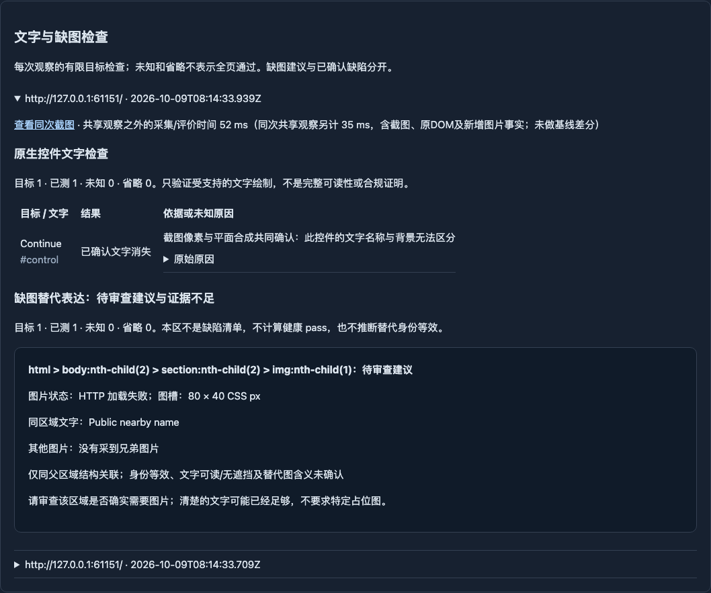

# D005 / R005：普通网址扫描接入

2026-10-09（Asia/Shanghai）。**在本独立候选中，已开启的网址扫描现在默认执行 D005 并生成 R005 审查材料。用户从原工作台选择网址检查、输入网址和可选目标即可；不需要实验 CLI、语义合同或额外实验开关。** API 仍使用原 `POST /api/runs` 的 ui-scan 请求。

本轮实现与实际运行候选为 **`156ffbea3bdbeb0ee7e4a8ace0bbe56efd3d9a44`**，位于 `codex/rule-image-proportion`，尚未合入 main、未推送。规则基线 `bdf914d`，固定 main `60c315a04e30b84356381763e33dd976a3ace836` 通过正常 merge `77699a8` 合入本分支，无冲突，保留双方历史、DNS与诊断修改。合并带入固定 main 已提交的 Roadmap 历史；本接入没有编辑 Roadmap，也没有修改维护者 main 工作区的未提交文件。未触碰 R1 的代码、构建、端口、数据库、配置或实验账本。

## 普通用户如何使用

在**原本已经开启网址扫描**的部署上，照常打开工作台，选择“网址 UI 检查”，填写网址，可选填检查目标，点击“开始检查”。结果中的“文字与缺图检查”直接展示：

- 原生控件的文字、定位、限定 pass/fail/unknown/not-applicable、可读原因和同次截图；受支持的 D005 fail 也进入原已确认缺陷清单。
- 独立的“缺图替代表达：待审查建议与证据不足”区域，包含图片状态、图槽尺寸、同区域文字、兄弟图片及关联限制。不要求用户打开 JSON，也不把建议放进缺陷清单。
- 每次观察的目标数、已采集记录数（界面“已测”，包含 unknown）、unknown 和省略数。未知/省略不是全部通过；旧观察可展开，新观察显示在前。

API 示例（服务地址由部署提供）：

```sh
curl -X POST "$UI_SENTINEL_URL/api/runs" \
  -H 'Content-Type: application/json' \
  -d '{"kind":"ui-scan","entryUrl":"https://example.org/page"}'
```

这是使用示例，本轮没有访问 example.org。已有的 `goal`、权限、范围与预算参数保持不变；可选目标仍由原扫描流程解释，本轮没有要求用户提供 CSS selector。API 报告增加 `uiRules` 历史投影，原 findings/inspection 语义不变。重新打开 `/?run=<runId>` 即恢复同一报告材料。

本轮**没有全局设置 EXECUTION_URL_SCAN**。两项仅由已开启的 ui-scan 执行器自动调用；全局注册器中的 D005 默认仍关闭，业务模式既有规则不变，D004和其他候选未启用。这是本轮明确授权的产品接入，不是主项目已上线的声明。



## 实际接线位置与事实生命周期

| 位置 | 实际行为 |
| --- | --- |
| [executor.ts](../../src/execution/executor.ts)，`if (uiScan)`、约1356行 | 导航前安装 `createUiRuleObservation` 与被动图片请求记录；仅 ui-scan 开启既有图片资源监听，业务分支不进入。 |
| 同文件 `performObservation/captureCurrent`，约1058行 | 在原正式观察前后读取有界事实，把图片 selector 合入同一次 observePage，使用同一 screenshot/snapshot。原 recapture/观察复用机制保留。 |
| 同文件 `performChecks`，约690行 | 调用已有 D005 factory/cache，将结果交回原 rule:evaluated、findings、检查台账路径。R005 不成为 RuleResult 或缺陷。 |
| [ui-rule-observation.ts](../../src/execution/ui-rule-observation.ts) | 只适配事实生命周期，直接复用原 `readBatch2Facts`、`screenshotInk`、`createControlTextDisappearanceRule`、`reviewImageFallbacks`；没有重写规则算法或放宽支持范围。 |
| [run-report.ts](../../src/server/reports/run-report.ts)、[ui-rule-report.ts](../../src/server/reports/ui-rule-report.ts) | 从已持久化事件/同run artifacts 恢复报告，验证正文和同次截图摘要及关联证据可读性；材料丢失/改变时显示证据不足，不重新推断结论。 |
| [main.tsx](../../src/web/main.tsx)、[ui-rule-report.tsx](../../src/web/ui-rule-report.tsx) | 普通 ui-scan 报告直接挂载可读分区；无实验页或专用审批流程。 |

每次正式观察至多枚举16个原生 button/a[href]、16个 img；D005保留1024个元素/64层祖先/单文字矩形100,000像素预算；被动图片请求元数据最多256条，现有资源字节预算保持。省略和超预算明确保留，不能据剩余目标推算全页。

两项共享被检查网页的浏览器、同次截图和普通 DOM/imagePaint。文字像素解码复用既有方法：在同一浏览器的隔离、拒绝网络上下文读取已保存截图，随后关闭；不是重开浏览器、额外访问网站或重拍整页。图片采集只读取正常浏览器已取得的响应，不补抓、不重放业务动作、不增加模型调用。

收据绑定 run/page/viewport、document/node、DOM epoch、截图和观察时间。评价前再次比对有界当前事实，过期/目标/资源/样式/页面变化拒绝旧事实；每次新观察重置适配器结果缓存。同一收据只有重新核对事实和完整性后才可标为重复结果。图片/动态页面仍按原观察复用机制保守处理。

稳定清洁证据下的已知绘制范围限制，使用现有 `unchecked` 能力边界表达并记录 unsupported；不是制造 pass 或修改完成门。网络干预、变化、真实执行/持久故障不享受该豁免，沿用原停止/未知契约。检查器仍可能报告部分 unknown，报告明确列出，不让模型为了“凑适用率”无限重试。本轮没有适用率准入门槛，也没有改 R0 sampling/完成门。

## 结论与支持范围保持

D005 仍为 `control-text-disappearance` 0.1.0：受支持、稳定、唯一、启用的原生纯文字控件，只有平面合成及截图共同证明文字消失才 fail；黑白文字像素是有限健康 pass。描边、阴影、圆角、复杂背景、伪元素、自定义字体、非支持颜色、歧义和不完整证据仍 unknown；正常禁用等明确例外仍不适用。无需为普通原生文字手填语义合同，但不扩张为完整可读性/WCAG判断。

R005 仍为 `image-fallback-review` 0.1.0 非Rule审查材料：loaded、loading、lazy未观察到请求、source-absent、HTTP/请求/解码失败按原语义显示。实际同区域文字、图片和布局只有结构关联；身份等效、文字可读无遮挡和替代图含义仍未知。缺头像、空槽和不用特定占位不自动 fail，不生成健康 pass；没有 native img 的实体仍无法枚举。

完整算法和正常反例沿用 [第二批历史交付](rules-batch2.md) 及其8项证据，本轮未重跑这些算法场景。新接入不覆盖全部广义知识、原 Jira 或公网可用率。

## 实际验证

构建仅本工作区的候选 server 与工作台；使用独立数据库、随机端口、固定本地 provider、真实 HTTP API/Chromium。所有页面为本地合成夹具，真实/付费模型调用0，公网访问0。未运行原71任务、R0/R1全量或真实业务旅程。

| 场景 | 产品链路证据 | 整体运行状态 |
| --- | --- | --- |
| 工作台只填网址 | 普通表单创建→D005白字白底 fail/已有缺陷行→HTTP404图片 review-needed；报告分区包含 Public nearby name，截图及历史恢复成功 | blocked；固定provider明确以 unverified-scope 收口 |
| 健康 | 普通API创建，D005黑白文字 pass，图片已加载不适用；不把加载状态称健康规则 pass | blocked；未执行原采样要求的控件操作 |
| 不支持 | 阴影文字全部 unknown，报告显示范围限制，不输出D005缺陷 | blocked；有限检查后正常收口 |
| 预算缺口 | 20个控件：记录16、unknown16、省略4；超过1024元素的扫描限制可见，没有补跑至成功 | blocked；正常收口，无循环 |
| 网络干预 | 目标图片和页面POST被原策略拒绝，两项均 unknown，无D005发现，服务端未收到业务写入 | blocked；原干预路径收口，provider调用0 |
| 目标更新 | 固定provider通过原 page_act 点击公开 Switch，夹具替换节点并改黑字；旧观察fail、新观察pass，至少两个不同截图，未用旧缓存放行 | completed / goal-reached，原完成证明验证成功 |

前五项 blocked 是如实保留原完整扫描义务/干预或固定provider主动选择的部分完成，**不是把局部健康/审查结果当整页通过**；六个测试场景的接入断言全部通过。除节点更新场景外无页面动作；更新场景仅1次原执行器click，无HTTP业务写入。全流程无 UI pageerror。

另有2项定向测试通过：业务默认注册/规则上下文仍只有既有三条规则、不取得D004/D005；历史报告遇到截图篡改/缺失拒绝原结论。此项是业务默认行为的定向核对，不宣称重新验证完整购物/导出旅程。

最终 `pnpm typecheck` 退出0，格式/差异核对通过。首轮六场景已经通过，补中文原因、耗时字段和截图摘要验证后重跑同一固定六场景，全部通过；一次新增耗时字段的TypeScript接线错误已在最终运行前修复。没有改变夹具以回避规则失败，没有为完成证明放宽原门。

复现命令（仅本候选工作区，本地免费；会创建自己的端口、数据库和候选构建）：

```sh
pnpm exec tsx scripts/validation/rules-scan-integration.ts
pnpm exec vitest run src/execution/ui-rule-integration.test.ts
pnpm typecheck
```

## 有限耗时与留存

最终6个run共13次正式观察。共享 observePage **之外**的新增事实采集/截图像素解码/评价小计为 **52–215 ms/次，中位61 ms**；20控件/超节点预算场景约202–215 ms。共享 observePage 整体为19–40 ms/次，里面包括原截图/DOM和新增图片事实，本轮未单独剥离图片采集增量。总run耗时约0.43–1.97秒，受原流程、固定provider和工作台请求影响。

这不是固定main与候选的性能差分基准，也不是公网性能预测；报告和索引保留每次原值，不能把小计当完整新增成本，更没有适用率门槛。

[机器证据索引](evidence/rules-scan-integration-20261009.json)保存合并/实现身份、源码/构建SHA、6个run结果、报告与原始artifact摘要、2项测试和日志。最终155个本地文件共6,047,804 B（含候选bundle、数据库、完整报告、下载/复制证据及重复副本，不是网站下载量）。索引与工作台分区截图随Git；完整原始材料在本机 `data/rules-scan-integration/2026-10-09T08-14-31-836Z/`，临时服务均已关闭。截图呈现的是合成普通工作台链路，不是公开网站或原Jira。

本轮完成普通产品链路并停止；能力只在上述独立候选分支可用，未推送或合入 main/R0/R1。旧实验历史保留，下一轮不自动启动。
